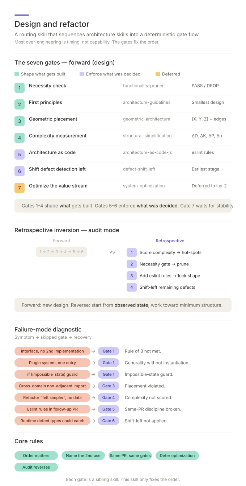

# Alchemy



An adaptive routing skill that qualifies requirements when needed, then
sequences the seven architecture gates into a deterministic flow. It preserves
short focused routes while preventing ungrounded, blocked, or unready work from
entering Architecture.

> **Reporting vocabulary.** Gate-output phrases below (e.g. "Domain / tier / layer per component", "Component-kinds / Dependency-edges / Max-chain-depth / Module-count Δ") match the coder-facing fields defined in the **Reporting Vocabulary** sections of [`geometric-architecture`](../.claude/skills/geometric-architecture/SKILL.md) and [`structural-simplification`](../.claude/skills/structural-simplification/SKILL.md). Those sections also list the internal axis symbols (`X, Y, Z`, `D, K, P, n`) that the model uses underneath.

## Why use this

- **Routing becomes deterministic.** The same evidence state selects the same
  qualification stages and gate order instead of relying on ad hoc judgment.
- **Requirements are qualified without bloating every route.** Grounding,
  topology, and readiness run only when evidence, relationships, or build
  preparation require them.
- **Speculative generality is caught at Gate 1, not after a rewrite.** Every abstraction has to name a second concrete instance before it lives.
- **Enforcement never precedes design.** Architecture-as-code rules are written *with* the code, not after — drift between PRs becomes structurally impossible.
- **Audits recover intent safely.** Existing-code reviews start from an observed
  structural baseline and only reconstruct requirements when trustworthy intent
  is absent.
- **Failure modes are nameable.** Symptom → skipped stage → recovery is an
  explicit diagnostic table, not a vibe.

## Fundamental principles

Most over-engineering is timing, not capability. Run enforcement before necessity and the architecture freezes whatever the design got wrong on the first pass. The gates exist because the failure modes are systematic.

- **Order matters.** Gates 1–4 shape *what* gets built. Gates 5–6 enforce *what was decided*. Run 5 before 1 and you machine-check a speculative design.
- **Name the second instance.** Rule of 3 is the null hypothesis; an abstraction without a named second concrete user is YAGNI.
- **Same PR, same gates.** `eslint.architecture.mjs` ships with the code it governs. Follow-up PRs to "add the rules" are drift.
- **Defer optimization.** `system-optimization` requires a stable baseline; running it on iteration 1 optimizes a system that has not yet faced real change.
- **Audit starts at `C₀`.** The read-only structural baseline exposes hot-spots
  and bounds any conditional requirements-recovery work before remediation.
- **Resume from evidence.** Re-entry starts at the latest trustworthy decision
  artifact and returns to the earliest failed stage instead of replaying the
  whole pipeline.

## How to use

The skill is a command entrypoint. Use it for **designing** a new module,
**auditing** existing code for over-engineering, or running one focused gate.

```
/alchemy <subject>   | $alchemy <subject>   route through the needed gates
/alchemy audit <subject> | $alchemy audit <subject> start at the C₀ baseline
/alchemy full <subject>  | $alchemy full <subject>  traverse all justified stages
/alchemy M <subject> | $alchemy M <subject> Minimum: worth it?
/alchemy A <subject> | $alchemy A <subject> Architecture: sound design?
/alchemy L <subject> | $alchemy L <subject> Locality: where belongs?
/alchemy C <subject> | $alchemy C <subject> Complexity: simpler?
/alchemy E <subject> | $alchemy E <subject> Enforcement: rules as code?
/alchemy H <subject> | $alchemy H <subject> Hermetic: catch earlier?
/alchemy Y <subject> | $alchemy Y <subject> Yield: optimize flow?
/alchemy left <subject> | $alchemy left <subject> detect defects earlier
/alchemy out <subject>  | $alchemy out <subject> move toil out of humans
/alchemy down <subject> | $alchemy down <subject> move bespoke code down
```

Use `/alchemy ?` or `$alchemy ?` to print the grammar without running a gate.

1. **Identify the trigger.** Introducing a new module / service / library, refactoring across module boundaries, designing a new abstraction, extracting a sub-component into a package, or auditing existing code for over-engineering.
2. **Prompt the AI.**

   > *Design:* "/alchemy I'm extracting the import logic into its own module so it can ship to npm."
   >
   > *Audit:* "/alchemy audit `packages/shared-ui/js/biomarker-import/`. Flag any speculative generality."
   >
   > *Shorthand:* "/alchemy this auth refactor."
   >
   > *Focused gate:* "/alchemy E the new module boundaries."
   >
   > *DevOps improvement triad:* "/alchemy out release handoffs."

3. **Read the verdict.** The default response is terse: route, verdict, one- or two-line reason, and next action. Full gate tables appear only for multi-gate runs, non-trivial design/refactor passes, audits, or explicit requests for detail.
4. **Apply the fix.** For focused gates, apply only that gate's next action. For
   full passes, qualify uncertain requirements, stop at the first non-passing
   decision, drop everything M rejects, place each surviving component at its
   Domain / Tier / Layer position, compute Component-kinds / Dependency-edges /
   Max-chain-depth / Module-count Δ, write the architecture file, and move every
   error path to its earliest catchable stage.

## Requirements Qualification Phase

The three requirements skills span **M — Minimum** without becoming new letters
in A.L.C.H.E.M.Y.:

```text
requirements-grounding, when meaning or evidence is absent or stale
→ M — Minimum
→ requirements-topology, when relationships are non-trivial
→ implementation-readiness
→ A — Architecture
```

- `GROUNDED` work may enter M; `PROVISIONAL` and `NOT-GROUNDED` return to
  grounding.
- M alone owns `BUILD`, `KEEP`, `SIMPLIFY`, `DEFER`, `DROP`, and `OBSOLETE`.
- `STABLE` topology may enter readiness; `NEEDS-REFACTOR` and `BLOCKED` return
  upstream.
- `READY` may enter A. `PARTLY-READY` may enter only as a bounded reversible
  slice whose unresolved requirements cannot change its meaning or
  verification. `NOT-READY` stops.
- A single bounded independent requirement may skip topology when the decision
  trail records why.

Focused aliases remain focused. If `/alchemy A` lacks a trustworthy readiness
decision, it reports that prerequisite instead of silently running the full
phase.

After readiness admits a slice, `requirements-traceability` follows work through
implementation, verification, review, and closeout. It is not another
qualification stage or gate: readiness defines what evidence will be needed;
traceability records implementation separately from executed proof.

## The seven gates at a glance

| #   | Gate                          | Skill                                                                                | Output                                       |
|-----|-------------------------------|--------------------------------------------------------------------------------------|----------------------------------------------|
| **1** | Necessity check               | [`functionality-complexity-tradeoff`](../.claude/skills/functionality-complexity-tradeoff/)                      | BUILD / KEEP / SIMPLIFY or stop per candidate |
| **2** | First principles              | [`architecture-guidelines`](../.claude/skills/architecture-guidelines/)                             | Smallest correct design                      |
| **3** | Geometric placement           | [`geometric-architecture`](../.claude/skills/geometric-architecture/)                               | Domain / tier / layer per component + allowed dependency edges |
| **4** | Complexity measurement        | [`structural-simplification`](../.claude/skills/structural-simplification/)                         | Component-kinds Δ, Dependency-edges Δ, Max-chain-depth Δ, Module-count Δ |
| **5** | Architecture as code          | [`architecture-as-code`](../.claude/skills/architecture-as-code/) (pattern); [`-javascript`](../.claude/skills/architecture-as-code-javascript/) / [`-python`](../.claude/skills/architecture-as-code-python/) (impl) | Per-module architecture config        |
| **6** | Shift defect detection left   | [`defect-shift-left`](../.claude/skills/defect-shift-left/)                                         | Each error path → earliest catchable stage   |
| **7** | Optimize the value stream     | [`system-optimization`](../.claude/skills/system-optimization/)                                     | Constraint analysis (deferred to iter 2)     |

The skill does not duplicate sibling content. Each gate is one row in this table; running a gate means invoking its sibling skill.

## DevOps improvement triad

The triad is separate from the core seven-gate sequence:

| Command | Skill | Use when |
|---------|-------|----------|
| `/alchemy left` | [`defect-shift-left`](../.claude/skills/defect-shift-left/) | Defects are found too late; move detection to the earliest capable stage. |
| `/alchemy out` | [`push-out`](../.claude/skills/push-out/) | Recurring operational work lives in human memory, tickets, or local team practice. |
| `/alchemy down` | [`bring-down`](../.claude/skills/bring-down/) | Bespoke, duplicated, or over-local code should move into reusable capability. |

Run triad commands directly when the user names the move. `/alchemy Y` can
recommend `out` or `down` when a bottleneck is toil or bespoke implementation,
but the triad does not run by default inside the seven-gate sequence.

## The retrospective entry

When auditing existing code, begin with `C₀`, a read-only structural baseline.
Recover provisional requirements only when current intent is missing, stale,
contradictory, or disputed:

| Step | Skill                                                          | Action                                                                              |
|------|----------------------------------------------------------------|-------------------------------------------------------------------------------------|
| **1 — C₀** | [`structural-simplification`](../.claude/skills/structural-simplification/) | Establish the current structural baseline and bound the hotspot. |
| **2 — conditional** | [`requirements-grounding`](../.claude/skills/requirements-grounding/) | Recover evidence-linked intent when no trustworthy current requirement exists. |
| **3** | [`functionality-complexity-tradeoff`](../.claude/skills/functionality-complexity-tradeoff/) | Decide whether bounded existing functionality remains necessary and worthwhile. |
| **4 — conditional** | [`requirements-topology`](../.claude/skills/requirements-topology/) and [`implementation-readiness`](../.claude/skills/implementation-readiness/) | Structure non-trivial remediation dependencies and admit the smallest coherent slice. |
| **5** | Remaining A.L.C.H.E.M.Y. gates | Redesign, enforce, and shift defects left as the remediation requires. |

Implementation remains evidence rather than product intent: code-derived
requirements stay provisional until supported by an authoritative artifact or
independent confirmation.

## The failure-mode diagnostic

When a design ships overbuilt or under-qualified, the symptom usually points at
one skipped stage. The diagnostic table now also catches assumed or stale
problems, cyclic or contradictory requirement ordering, invented implementation
meaning, and unsafe `PARTLY-READY` slices.

- Interface added "for the second implementation" but the second never lands → Gate 1, Rule of 3.
- Generic registry / plugin system with one entry → Gate 1, generality without instantiation.
- Empty config / config with one value across all envs → Gate 1, one-value config.
- `if (impossible_state)` runtime guards → Gate 1, impossible-state guard.
- Cross-domain imports across non-adjacent faces → Gate 3, placement violated.
- Refactor "felt simpler" but no measurement → Gate 4, complexity not scored.
- Eslint rules added in follow-up PR → Gate 5, same-PR discipline broken.
- Architecture file disagrees with code → Gate 5, drift.
- Defects caught at runtime that types could express → Gate 6, left-shift not applied.

Each row points back to the gate that would have caught it prospectively.

## When to skip

Bug fixes within an existing module, content/copy edits, CSS-only changes, dependency bumps, trivial renames. The skill earns its keep when module boundaries are being drawn, crossed, or audited — not for routine work inside a governed component.

## Next steps

- See [SKILL.md](../.claude/skills/alchemy/SKILL.md) for the full pre-flight checklist, gate sequence, and failure-mode diagnostic table.
- For the necessity gate (Gate 1) and what it catches in detail, see [`functionality-complexity-tradeoff`](../.claude/skills/functionality-complexity-tradeoff/).
- For the adaptive qualification phase, see
  [`requirements-grounding`](../.claude/skills/requirements-grounding/),
  [`requirements-topology`](../.claude/skills/requirements-topology/), and
  [`implementation-readiness`](../.claude/skills/implementation-readiness/).
- For post-readiness evidence, see [`requirements-traceability`](../.claude/skills/requirements-traceability/).
- For first-principles rules driving Gate 2, see [`architecture-guidelines`](../.claude/skills/architecture-guidelines/).
- For the Domain / Tier / Layer placement model used at Gate 3, see [`geometric-architecture`](../.claude/skills/geometric-architecture/).
- For the per-axis complexity scoring used at Gate 4, see [`structural-simplification`](../.claude/skills/structural-simplification/).
- For the enforcement files produced at Gate 5, see [`architecture-as-code`](../.claude/skills/architecture-as-code/) (the pattern), with [`-javascript`](../.claude/skills/architecture-as-code-javascript/) and [`-python`](../.claude/skills/architecture-as-code-python/) as concrete implementations.
- For the shift-left hierarchy applied at Gate 6, see [`defect-shift-left`](../.claude/skills/defect-shift-left/).
- For the constraint analysis applied at Gate 7, see [`system-optimization`](../.claude/skills/system-optimization/).
- For the DevOps improvement triad, see [`defect-shift-left`](../.claude/skills/defect-shift-left/), [`push-out`](../.claude/skills/push-out/), and [`bring-down`](../.claude/skills/bring-down/).
- For the meta-loop that updates this skill when a gate is repeatedly skipped, see [`continuous-improvement`](../.claude/skills/continuous-improvement/).
