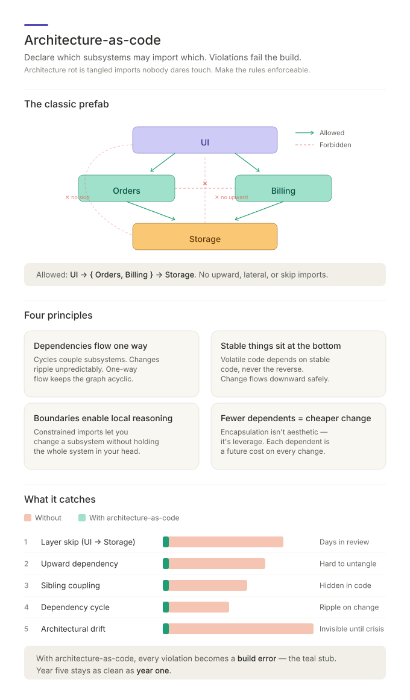

# Architecture-as-Code (Pattern)



A stack-agnostic pattern: declare each module's allowed dependencies in a
small config file that lives next to the code. A small assembler discovers
those files, merges them recursively, and emits a single ruleset for your
language's import-graph linter. Violations fail the build with a
plain-English `why`.

## Why use this

- **Architectural violations are caught at build time**, not days later in
  review.
- **Refactors follow the architecture automatically.** Change a rule; lint
  flags every file that must update.
- **Rules document themselves.** Every violation reports a plain-English
  reason.
- **New developers learn the architecture from the rules**, not from
  mistakes.
- **Architectural drift becomes impossible.** Year-five stays as clean as
  year-one.
- **Architecture decisions get a mechanical handoff.**
  `architecture-guidelines` or `morphogenetic-architecture` decides the
  constraint; this pattern encodes only the enforceable import/dependency rule.

## Fundamental principles

Architecture is largely the art of managing dependencies. Most rot in
long-lived codebases isn't bad logic — it's tangled imports nobody dares
touch.

- **Dependencies flow one way.** Cycles couple modules; changes ripple
  unpredictably.
- **Stable things sit at the bottom.** Volatile code depends on stable code,
  never the reverse.
- **Boundaries enable local reasoning.** Constrained imports let you change
  a module without holding the whole system in your head.
- **Fewer dependents = cheaper change.** Encapsulation isn't aesthetic; it's
  leverage.

Architecture-as-code makes these principles *enforceable* instead of
aspirational.

## How it combines with architecture decisions

Use `architecture-guidelines` to decide an internal design constraint or
`morphogenetic-architecture` to decide a placement, interface-direction, or
static-topology constraint. Either skill emits an `Enforcement` handoff. Use
this pattern second to translate that handoff into components, forbidden edges,
config placement, and lint verification.

Example:

```text
Guideline:    Domain logic depends on abstractions, never infrastructure.
Enforcement: add architecture rule: forbid payments-domain -> payments-infra
As-code:     add the component patterns and forbidden edge in the relevant config.
```

## How the pattern works

1. **Module = directory** (or single-file unit for a facade). A module's
   identity is its path.
2. **One optional config file per module**, declaring the module's
   components and forbidden dependency edges. Repo root has one too.
3. **A module knows itself, not its context.** Its own file may name only
   its own-prefix components and the anonymous `*`. Inbound rules
   ("who may import me?") live higher up, where the module is composed
   with peers.
4. **An assembler walks the tree** — deeper-first — concatenates the
   declarations, expands wildcards against the live component registry, and
   emits a single config for the language's lint tool.
5. **The lint tool runs in pre-commit and CI.** Violations print the `why`
   and fail the build.

## Where each rule lives

| Rule type                       | Lives in                  |
| ------------------------------- | ------------------------- |
| Afferent ("who may import me?") | Higher level (composer).  |
| Efferent ("what may I import?") | Own file.                 |
| Cross-module sibling-isolation  | Higher level (composer).  |
| Internal layering               | Own file.                 |
| Sub-tier sibling-isolation      | Own file.                 |

Higher-level rules accumulate. Place each rule where the composition it
expresses lives — sub-tier sibling-isolation in the module's own file (it
composes its sub-tiers); encapsulation between the module and its peers
higher up.

## The classic prefab: UI → Business → Storage

Four modules; two business modules that must stay independent. Allowed:
`ui → { orders, billing } → storage`. No upward imports. No lateral imports
between `orders` and `billing`.

This pattern appears in every layered system. Once you've expressed it
once for a stack, every new module either fits in or surfaces a real
architectural question.

## Implementations

The pattern skill defines the schema, the rule-placement discipline, the
assembler pipeline, and the anti-patterns. Concrete implementations live in
per-stack sibling skills:

| Stack      | Config file               | Lint tool                              | Primer |
| ---------- | ------------------------- | -------------------------------------- | ------ |
| JavaScript | `eslint.architecture.mjs` | ESLint + `eslint-plugin-boundaries`    | [READ-architecture-as-code-javascript](./READ-architecture-as-code-javascript.md) |
| Python     | `architecture.toml`       | `import-linter` (over Grimp)           | [READ-architecture-as-code-python](./READ-architecture-as-code-python.md) |

Adapting to a new stack: pick an import-graph linter that supports forbidden
edges between named module sets, then write a small assembler that emits its
native config. The schema, discovery, wildcard expansion, and rule-placement
discipline all transfer; only the emit and invoke steps are stack-specific.

## When to skip

Tiny projects, prototypes, throwaway scripts. Otherwise the cost is one
config file plus a pre-commit hook, and it pays off the first time someone
tries to import your storage layer from a UI handler.

## Next steps

- See [SKILL.md](../.claude/skills/architecture-as-code/SKILL.md) for the
  full pattern reference (schema, components, forbidden edges, rule
  placement, anti-patterns, pre-merge audit).
- For first principles on what goes inside a module, see
  [`architecture-guidelines`](../.claude/skills/architecture-guidelines/).
- For the placement and static-topology rationale behind layered/sibling rules,
  see [`morphogenetic-architecture`](../.claude/skills/morphogenetic-architecture/).
