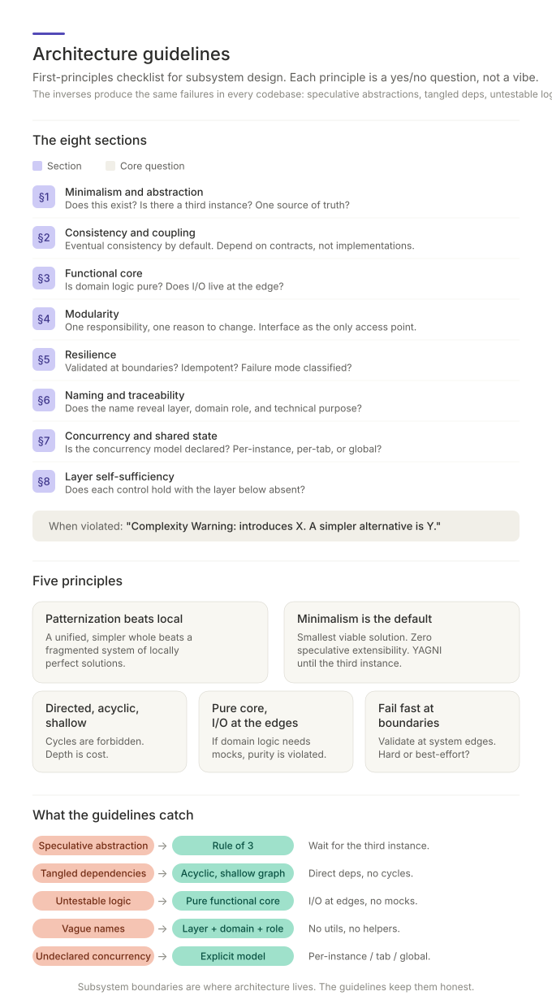

# The Shape of a Good Module

Two codebases can implement the same product, pass the same tests, and feel
completely different to work in. In one, adding a field to an invoice means
editing one directory. In the other, it means edits to nine files across four
directories, two of which surprise you, and a test failure in a module you've
never heard of.

The difference is not talent or effort. It is *structure* — and the
principles that produce the first codebase instead of the second are few,
old, and learnable. This document explains them from first principles: not as
a list of rules to memorize, but as consequences of one central fact about
software.

## The central fact: code is read and changed, not just run

The computer doesn't care how your code is organized. A single
million-line file executes identically to a beautifully-factored system.
Structure exists for exactly one audience — people making *changes* — and
so every structural principle answers the same underlying question:

> **When a change comes, how much must be understood, touched, and re-verified?**

Everything below is that question, applied at different points.

## Modules exist to contain change

A module — a directory, a package, a service — is a *blast wall*. Its
purpose is to guarantee that a category of change stays inside it. From
that purpose, the classical rules follow directly rather than needing to be
taken on authority:

- **One concern per module** (separation of concerns): if a module handles
  both invoice math and email formatting, a change to either forces a
  reader to understand — and risk breaking — the other.
- **One reason to change** (single responsibility): "responsibility" is
  best read as *a source of change*. If pricing rules and tax rules evolve
  on different schedules, driven by different stakeholders, a module
  containing both will be changed twice as often, by people who each care
  about only half of it. Two forces of change → two modules.
- **High cohesion, loose coupling**: the classic phrase compresses both
  directions of the same rule. Things that change together should live
  together (cohesion — otherwise one logical change scatters across the
  system), and things that change separately should touch only through
  narrow contracts (coupling — otherwise unrelated changes collide).

The practical test for a boundary is a *capability*: something with its
own domain name, its own lifecycle, its own reason to change. One
capability, one module. A directory holding three unrelated capabilities is
a blast wall around nothing.

## Interfaces: the deal between a module and the world

A boundary works only if everyone honors the same three-way deal:

- **The caller** depends on the contract, never on the implementation. The
  moment a caller reaches past the interface into a module's internals,
  the module can no longer change freely — the whole point of the boundary
  is forfeit.
- **The module** keeps its internals private. What isn't exposed can't be
  depended on, and what can't be depended on can be rewritten on a Tuesday
  without a meeting.
- **The designer** exposes everything every caller needs and *only* what
  every caller needs. Every exposed function is a promise you must keep
  forever; generosity in an interface is future regret.

## Dependencies: directed, acyclic, shallow

Draw every module as a dot and every "A imports B" as an arrow. That
picture — the dependency graph — has three health criteria, each protecting
the same thing: your ability to reason about one part without holding the
whole system in your head.

- **Directed**: know which way the arrows are supposed to point. Stable,
  general things (domain logic) should not depend on volatile, specific
  things (frameworks, databases, HTTP). When domain logic needs a
  database, have it depend on an *abstraction* ("something that stores
  orders") and let the concrete database plug in from outside — this is
  dependency inversion, and it's what keeps a database swap from becoming
  a domain rewrite.
- **Acyclic**: a cycle (A → B → C → A) means none of the three can be
  understood, tested, or replaced alone — they've fused into one unit that
  happens to be spread across three names. Cycles are not "high coupling";
  they are boundary failure, full stop.
- **Shallow**: every hop in the chain a change must traverse is another
  file to open and another layer where the actual behavior can hide. Depth
  is not sophistication; depth is cost, paid per change. A layer that
  merely forwards calls has a negative value.

## The functional core: purity as a load-bearing decision

The single highest-leverage structural decision available in most codebases:

> **Business logic is pure. Input/output lives at the edges.**

"Pure" means: given the same inputs, the same outputs, touching nothing
else — no database calls, no clock reads, no network. The pattern is to
shape each operation as a sandwich: an edge gathers everything needed
(reads, current time, config), a pure core makes *all* the decisions, and
an edge executes the resulting effects.

Why it's worth restructuring around: a pure core is **testable without
mocks** — plain functions, plain assertions, no test doubles simulating a
database. That's also the diagnostic in reverse: *if testing your business
logic requires mocks, side effects have leaked into the core.* The tests
are telling you about the architecture. Purity also composes with
resilience for free — a pure decision can be retried, replayed, or run
twice without harm; only the effectful edges need idempotency care.

## Minimalism: the discipline of not building

The cheapest structure is the one that doesn't exist, which makes restraint
a first-class architectural skill with three named tools:

- **YAGNI** — no speculative features, no extensibility hooks for
  hypothetical futures. Flexibility you don't use is pure cost, and worse:
  speculative flexibility usually bets on the *wrong* axis of change, so
  when the real requirement arrives you pay to remove the old hook first.
- **The Rule of Three** — don't abstract on the second occurrence; wait for
  the third. Two data points define any line you like; three reveal what
  actually varies. And below roughly twenty lines, copying is often
  cheaper than the coupling an abstraction introduces — a wrong
  abstraction binds every user to every other user's future needs.
- **DRY, correctly scoped** — the rule is about *knowledge*, not
  keystrokes. A business rule, a constant, a schema: exactly one
  authoritative home, because two copies of knowledge will disagree
  eventually. But two functions that merely *look* alike may be
  coincidence; deduplicating them welds together things that will want to
  evolve apart. Dry up knowledge; leave lookalike code to the Rule of
  Three.

One more habit belongs here: when a ticket arrives with a prescribed
implementation plan, check the *framing* before executing step 1. Plan
authors prescribe solutions; your first duty is verifying the problem
exists in this system at all.

## Resilience: decide failure behavior before writing the code

Failure handling is an architectural decision that gets made *implicitly*
— and therefore badly — unless made explicitly, up front:

- **Fail fast.** Validate at the boundary, and reject bad input where it
  enters — the alternative is garbage flowing three layers deep and
  erupting somewhere with no visible connection to its cause.
- **Classify every external call** before implementing it: *hard* (failure
  must stop the operation) or *best-effort* (failure is logged and life
  goes on). An audit-log write and an analytics ping might sit on adjacent
  lines and deserve opposite answers; unclassified, they'll both get
  whatever the author's mood was.
- **Decide atomicity** for every multi-step operation: all-or-nothing (with
  rollback or compensation), or acceptable partial success (documented)?
  Designing the steps without deciding this is the classic path to systems
  that fail into undefined states.
- **Prefer idempotency and statelessness.** An operation that can safely
  run twice, and a service that remembers nothing between requests, are
  the two properties that make retries, crashes, and scaling boring.

## Layers do not inherit guarantees

A control belongs to a layer, and it either holds there or it doesn't. The
standing temptation is to let something underneath carry it: the service is
only reachable from inside the network, so the authorization check can stay
loose. That reasoning holds exactly as long as the network keeps that shape —
and its shape is decided elsewhere, by people changing infrastructure, in a
change that touches none of the code depending on it. The guarantee
disappears silently; the code that assumed it is unchanged and still passing
its tests.

So design each control as if the layer below were absent: every
authentication and authorization decision must survive the endpoint being
publicly reachable. Isolation, private links, and firewalls stay valuable —
as *additional* layers. The moment one of them is counted as the control
itself, there is only one layer, and nobody wrote it down.

## Naming: the structure should confess

A name is the cheapest documentation that can never go stale, and the
standard is *traceability*: from a file's path and name alone, a newcomer
should be able to infer what domain it serves, which layer it lives in, and
what it does — `billing/invoice-tax-calculator` passes; `utils/helpers.ts`
fails on every count, and worse, it *invites* failure: a junk-drawer name
attracts junk, accreting unrelated logic until it's coupled to everything.
A thing you can't name precisely is usually a thing you haven't scoped
precisely — naming trouble is design feedback.

## The habit

The principles compress into questions to ask of any design, new or
inherited: *What forces of change does this module contain — one, or
several? Could its internals be rewritten without any caller noticing?
Which way do the arrows point, and is there a cycle? Can the business logic
be tested without mocks? Is this abstraction paying rent today, or is it a
bet on a future that may never come? What happens when each external call
fails — and did anyone decide that, or did it just happen? Would every
control still hold if the layer beneath it vanished?*

None of these require seniority to ask. They require only the central fact:
code is a thing people change, and structure is how you make change cheap.

---

*Related concepts:
[structural simplification](READ-structural-simplification.md) turns
"simpler" from a feeling into a four-axis measurement;
[morphogenetic architecture](READ-morphogenetic-architecture.md) governs
where modules belong and how boundaries evolve under evidence; and
[architecture-as-code](READ-architecture-as-code.md) turns the dependency
rules above into build-failing lint checks. The full operational reference
for this concept lives in
[SKILL.md](../.claude/skills/architecture-guidelines/SKILL.md).*
