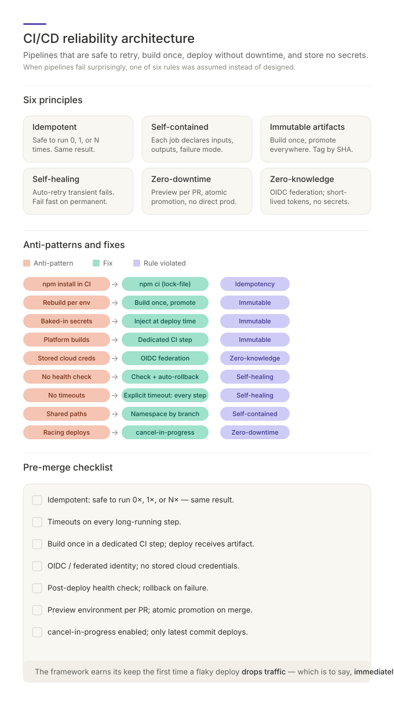

# Reliable Pipelines: Deploys You Can Run Twice

The deploy fails halfway. The new version is on three servers out of six,
the database migration ran, the cache config didn't, and the person who
understands this pipeline is on a plane. Someone asks the question that
defines the next four hours: *"can we just run it again?"*

If the honest answer is "nobody knows" — re-running might fix everything,
double-apply the migration, or take the site down — then the pipeline isn't
automation. It's a loaded script. The difference between the two is not
luck or tooling; it's a small set of architectural properties that can be
designed in, checked for, and enforced. This document explains them.

## Idempotency: safe to run twice

The foundational property is **idempotency**: a step converges to the same
desired state whether it runs once, twice, or is retried after a partial
failure. `mkdir -p` is idempotent; `mkdir` is not. "Create the new
credential, then remove the old one if present" is idempotent; "delete the
old credential, then create the new one" is not — and the gap between its
two steps is a window where nothing works.

Idempotency is what makes the 2am question boring. When every step is
idempotent, "can we just run it again?" is always answered *yes* — the
pipeline picks up where reality actually is and converges to where it
should be. Writing steps this way costs a little more thought up front
(check-then-act, conditional writes like `WHERE version = X`,
create-before-delete) and pays for itself the first time anything fails
midway — which, over enough deploys, is a certainty, not a risk.

The same property scales up to infrastructure: declarative tools (Terraform,
Bicep, Pulumi) are, at bottom, idempotency engines — you state the desired
state and the tool computes the difference from what exists. Imperative
scripts can be made idempotent by hand; at scale, the declarative form does
it by construction.

## Self-contained steps: no invisible handoffs

A pipeline step that "just knows" things — that the previous job left files
in a certain directory, that the runner has a tool installed, that some
environment variable is set — works until the day the assumption breaks,
and then fails in a way that points nowhere near the cause.

The fix is a contract: every job explicitly declares its **inputs** (which
upstream jobs it needs, which artifacts it downloads — never assumes are
present), its **outputs** (named, namespaced by commit SHA so parallel runs
can't collide), and its **failure mode** (fail fast by default, with an
explicit timeout so a hung step can't silently absorb an hour). A pipeline
built from self-contained steps can be reordered, parallelized, retried,
and debugged step by step. One built on ambient assumptions can only be run
end-to-end and prayed over.

## Immutable artifacts: build once, promote

Here's a quiet source of production surprises: the code that was tested in
staging and the code that reached production were *never the same bytes*.
The pipeline rebuilt between environments, and the second build pulled a
slightly newer dependency, or ran with different flags, or embedded a
different config. All the testing validated an artifact that was then
thrown away.

The principle that eliminates this class of failure entirely:

> **Build once. Promote the same artifact through every environment.**

The build step produces one versioned, immutable artifact — an image, a
bundle, an archive — tagged with the commit SHA (branch names move; SHAs
don't). Everything environment-specific (API URLs, feature flags, secrets)
is injected at *deploy* time, never baked in at build time — same artifact,
different config. "Promote to production" then means *deploy the exact
bytes that passed staging*, and — the underrated payoff — **rollback**
means *redeploy yesterday's known-good artifact from the registry*: a
two-minute operation, instead of reverting code, rebuilding, and hoping the
new build behaves like the old one did.

One trap deserves its own warning: deploy platforms that helpfully rebuild
your app for you. Implicit platform builders are notorious for reporting
success while a sub-build quietly failed, shipping stale output. The build
belongs in your CI, as an explicit fail-fast step; the deploy step should
receive a finished artifact, not source code and optimism.

## Self-healing: retry the transient, refuse the permanent

Failures come in two kinds, and treating them identically is wrong in both
directions:

- **Transient** — a timeout, a connection refused, an HTTP 503. The world
  hiccupped; the same request may succeed in ten seconds. These deserve a
  bounded retry with exponential backoff.
- **Permanent** — a 404, a missing file, a syntax error, a failed
  assertion. The same input will fail the same way forever. Retrying is
  noise at best; at worst it masks the error until it's expensive. These
  deserve an immediate, loud failure.

Retrying permanent failures wastes minutes and buries the signal; failing
fast on transient ones makes the pipeline flaky and teaches people to
click "re-run" reflexively — which then hides *real* failures too. And
after every deploy, one non-negotiable check closes the loop: a health
probe against the deployed service, with automatic rollback on failure. A
deploy that ends at "the script exited 0" has verified that the *script*
worked, not that the *service* does.

## Zero-downtime: never operate on the live patient

The pattern behind every zero-downtime strategy is the same three-step
shape: **prepare the new thing next to the old thing → verify it → switch
atomically.** Deploy to a staging slot or preview environment, health-check
it there, then swap traffic — letting in-flight requests drain rather than
force-killing instances mid-request. Its inverse is the anti-pattern behind
most self-inflicted outages: modify the live thing in place and verify
afterward, with users as the test harness.

The same "old and new must coexist" logic governs contracts. During any
rollout, some clients still speak yesterday's API against today's server —
so changes must be additive, with breaking changes versioned and deprecated
on a schedule, and database schema changes made in *expand/contract* style:
add the new column, migrate readers and writers, and only then drop the old
one, so every intermediate state works with both versions.

## Zero-knowledge secrets: the best credential is none

Every long-lived credential stored in CI is a standing liability: it can
leak in a log, be exfiltrated from a compromised runner, or simply be
forgotten and never rotated. The modern posture minimizes what exists to
steal. For cloud auth, federated identity (OIDC) lets the pipeline *prove
who it is* per run and receive a short-lived token — no stored password at
all, nothing to leak that's still valid an hour later. Secrets that must
exist live in a managed store with audit logging and rotation, and rotation
follows the idempotent order: **create the new, apply it everywhere,
verify, then delete the old** — never delete-first, whose gap is downtime.

## Promotion is evidence, not a command

The final principle ties the rest together: reaching production is not "the
deploy command exited 0." It's a sequence of gates, each demanding evidence
before the next state is allowed — the artifact is the same digest that
passed testing; pre-deploy checks (config, migrations, secrets,
permissions, rollback artifact on hand) all passed *before anything was
mutated*, while aborting was still free; the rollout strategy had explicit
health thresholds; and a bounded verification window watched error rates
and latency after the switch, with breach triggering automatic rollback.
Only then is the release *done* — recorded, and handed to a named owner.

Each gate is a place where a bad release stops cheaply instead of
expensively. A pipeline without them doesn't ship faster; it just finds
out later.

## The habit

The properties compress into one interrogation you can run against any
pipeline — yours or one you've inherited: *If this fails halfway, can I run
it again safely? Are the bytes in production the bytes that were tested?
Does each step declare what it needs, or assume it? What happens
automatically when the health check fails? What is standing still,
credential-wise, that could be short-lived instead? And what evidence, not
optimism, gates the promotion?* Every "I don't know" is a 2am call that
hasn't happened yet.

---

*Related concepts: [shift-left](READ-defect-shift-left.md) governs where
each verification gate belongs — at the earliest stage able to catch its
defect; [flow](READ-system-optimization.md) optimizes the value stream that
runs *on top of* a reliable pipeline (stability first, then speed). The
full operational reference for this concept — checklists, gate tables, and
the promotion state machine — lives in
[SKILL.md](../.claude/skills/ci-cd-reliability-architecture/SKILL.md).*
