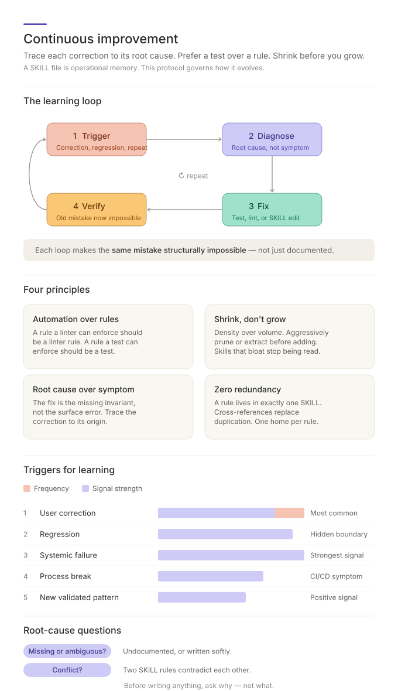

# Continuous Improvement (Meta-Learning)

A protocol for updating SKILL files when the agent makes a recurring or high-impact mistake, or when the skill library itself needs optimization. Trace each correction to its root cause; check whether a test, linter, schema, type, build gate, validator, or template should own the fix before adding prose.

## Why use this

- **Recurring mistakes get fixed once.** A correction becomes an owned rule, test, lint check, schema, or template, not a sticky note that fades.
- **Skills don't bloat over time.** New guidance first tries to replace, merge, or tighten existing guidance; density beats volume.
- **Symptoms aren't preserved as rules.** Every change traces to the missing boundary, ambiguous wording, or misunderstood platform behavior — not to the surface error.
- **Automation is checked before instruction.** Before adding a sentence to a SKILL, the protocol checks whether an enforceable artifact should own the rule.
- **Skills stay non-redundant.** Cross-skill overlap is routed to a primary owner; brief references are allowed when they prevent misuse.
- **Skill edits get guardrails.** Mirror sync, primer backlinks, frontmatter, and output-shape checks belong in validation when they can be detected mechanically.

## Fundamental principles

A SKILL file is operational memory. Without a discipline for updating it, two failure modes appear: the same mistake recurs because the lesson was never written down, or the file bloats with overlapping rules until nobody reads it. This protocol governs how SKILLs evolve.

- **Automation before prose.** A rule a linter can enforce should usually be a linter rule; a rule a test can enforce should usually be a test. If automation is infeasible or too costly, record why.
- **Density over volume.** Prefer replacing, merging, or tightening existing rules before adding new ones.
- **Root cause over symptom.** The fix is the missing invariant, not the surface error.
- **Single owner, explicit references.** A rule has one primary owner; cross-references replace duplication when another skill needs to route readers there.

## How to use

The skill activates when the agent is corrected on an issue likely to recur, when a fix breaks something else, when a new validated pattern should become reusable, or when the same anti-pattern class is attempted repeatedly.

1. **Recognize a learning trigger.** User correction, regression, new validated pattern, repeated anti-pattern, or recurring CI/lint failure.
2. **Prompt the AI.**

   > *"I just corrected the agent on [X]. Apply continuous-improvement: trace the root cause, decide whether it should be automation or a SKILL update, and pick the right SKILL."*

3. **Read the diagnosis.** The skill names the root-cause category (missing/ambiguous, conflict, ignored rule, technical-constraint), the proposed fix (test, linter, or SKILL edit), and the SKILL that owns the change.
4. **Apply the update.** Add or update the owned artifact, prune only obsolete or contradictory guidance, keep mirrors, primers, and any affected README index text aligned, run the skill validator, and verify that the previous mistake is caught earlier or made less likely.

## Skill-library optimization

When improving the skills themselves, define the behavior to improve before editing wording. Prefer validator, template, or primer checks for drift risks; keep reusable rules in one owning SKILL; let sibling skills route to the owner; update `.agents`, `.claude`, the matching primer, and any affected README index text together.

When evidence comes from a consumer project, promote the reusable lesson into
the canonical library before repinning the consumer. Project names, paths,
commands, roles, taxonomies, and provider assumptions stay in a project profile
or local skill. The safe direction is consumer evidence → generic library
change → validated publication → consumer repin; never overwrite the library
from a vendored consumer tree.

## Triggers for learning

| Trigger Type        | Scenario                                                                              |
|---------------------|---------------------------------------------------------------------------------------|
| **Correction**      | User corrects an architectural pattern, approach, or rule.                            |
| **Regression**      | A fix for one issue breaks another — an undocumented system boundary.                 |
| **New Pattern**     | A new, validated standard is successfully introduced to the codebase.                 |
| **Systemic Failure**| The same anti-pattern class is attempted repeatedly, or once with high blast radius.  |
| **Process Break**   | Recurring CI/CD or linter failures indicating a broken foundational rule.             |
| **Skill Optimization** | User asks to optimize, prune, audit, or increase efficiency of the skill library itself. |

## Root-cause questions

Before writing anything, ask:

- **Missing or ambiguous?** Was the requirement undocumented, too broad, too absolute, or written with the wrong force?
- **Conflict?** Did two SKILL rules contradict each other?
- **Ignored due to invisibility?** Was the rule there but easy to miss? Improve placement or wording before promoting it to a warning block.
- **Technical constraint?** Was the failure due to a misunderstood platform or framework behavior?

## When to skip

Single, idiosyncratic corrections that don't generalize. One-off task tweaks. Anything that belongs in conversation memory rather than the SKILL library — if the next contributor wouldn't trip on the same edge, it's not a SKILL update.

## Output

Report the trigger, root cause, owner, automation decision, change type,
verification performed, and residual risk. Do not claim structural
impossibility unless an enforced gate guarantees it.

## Next steps

- See [SKILL.md](../.claude/skills/continuous-improvement/SKILL.md) for the full protocol (triggers, root-cause analysis, update execution, verification, notification).
- For SKILL formatting and layout, follow your project's skill-authoring conventions (separate from this skill).
- For first-principles architectural rules referenced when triaging trigger root causes, see [`architecture-guidelines`](../.claude/skills/architecture-guidelines/).
