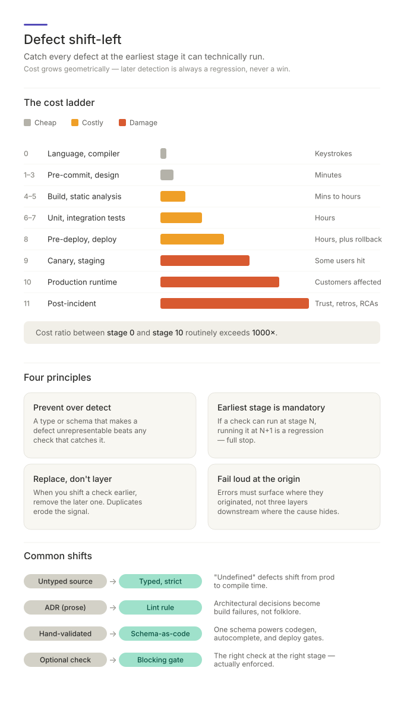

# Shift-Left: Why the Same Bug Costs a Keystroke or a Weekend

It's 02:14 and your phone lights up. Checkout is down. Two hours of log-digging
later you find it: a backend team renamed `customerId` to `customer_id` in an
API response last Tuesday, and your service has been reading `undefined` ever
since the evening deploy.

Now rewind. That exact defect — a field name that no longer matches — could
have been caught:

- by a **contract test** in CI, hours before the deploy;
- by the **compiler**, seconds after the rename, if your API types were
  generated from the API schema;
- or it could have been made **impossible to write**, if both services derived
  their types from one shared schema.

Same bug, four different price tags: a weekend, an afternoon, a keystroke,
or nothing at all. That is the entire idea of *shift-left*. This document
explains the concept — where the name comes from, why the economics are so
lopsided, and the handful of moves that exploit it.



## The pipeline is a timeline

Picture everything that happens to a line of code, left to right: you design,
you type, you commit, it compiles, it's tested, it's deployed, it runs in
production. That's a pipeline of stages, and the stages have a strict order —
compile always happens before deploy, deploy always happens before an incident.

Two facts make this ordering interesting:

1. **Every defect has an earliest stage where it is technically detectable.**
   A null dereference can be caught by a type system while you type. A
   migration that conflicts with the production schema can't be caught while
   you type — the information doesn't exist yet — but it *can* be caught by a
   dry-run just before deploy. Each defect class has a leftmost possible home.

2. **The cost of catching a defect grows roughly geometrically with each
   stage it survives.** Not linearly — geometrically.

| When it's caught | What it costs |
| ---------------- | ------------- |
| While typing (compiler, editor) | Keystrokes |
| At commit or build | Minutes |
| In the test suite | Minutes to hours |
| Just before deploy | Hours — but the deploy can still be aborted |
| During deploy | Hours, plus a rollback |
| In production | Customers, on-call pages, lost sleep |
| In the post-incident review | Trust, and days of engineering time |

"Shift left" means: for every check you have, and every defect that escapes,
push detection toward the left end of that timeline — to the earliest stage
technically capable of catching it.

## Why the cost curve is geometric

The multiplier isn't magic; it comes from four things that each get worse with
every stage:

- **Feedback loop length.** A red squiggle arrives in milliseconds while the
  code is still in your head. A CI failure arrives in twenty minutes, after
  you've moved on. A production incident arrives days later, after everyone
  has moved on.
- **Context loss.** The person best equipped to fix a defect is the person who
  just wrote it, in the minute they wrote it. Every stage later, the fixer
  knows less and has to rediscover more.
- **Blast radius.** At the editor, a defect affects one file. In CI, it blocks
  a team. In production, it affects customers — and rolling it back can drag
  unrelated changes with it.
- **Headcount.** A compile error involves one person. An incident involves
  on-call, a manager, a post-mortem, and sometimes a customer email.

This is why "we caught it in testing" is not automatically good news. If the
defect was catchable at compile time, catching it in a test suite was already
several multipliers too late. Later detection is never neutral — it is always
a regression against the earliest possible stage.

## Prevention beats detection

The furthest left you can go isn't a check at all. Some defects can be made
**unrepresentable** — the language simply refuses to express them.

Consider a function that takes a user ID and an order ID, both plain strings:

```ts
function cancel(userId: string, orderId: string) { ... }

cancel(order.id, user.id); // compiles fine, corrupts data at runtime
```

No test catches every call site. But give the IDs distinct types and the
mistake stops being writable:

```ts
type UserId  = string & { readonly brand: "UserId" };
type OrderId = string & { readonly brand: "OrderId" };

cancel(order.id, user.id); // compile error — argument order is wrong
```

The same trick has many faces, all of them "move the defect into the type
system so no check is needed":

- **Exhaustive enums / sum types** — add a new order status and the compiler
  lists every `switch` you forgot to update. The "missing case" bug class
  disappears.
- **Option/Result types** — the code won't compile until you've said what
  happens when the value is absent. Null dereference disappears.
- **Strict compiler flags** — turning on `strict` or `strictNullChecks` (or
  `mypy --strict` in Python) makes the compiler enumerate an entire backlog
  of latent defects for you. Each flag is a one-line change that deletes a
  bug class.

The rule of thumb: before adding a check anywhere, first ask *"can a type or a
schema make this defect impossible instead?"* Prevention is free forever;
detection costs a little every day.

## One schema, many stages

The single highest-leverage shift-left move is describing a data shape
**once**, in a machine-readable schema, and letting that one artifact do work
at every stage:

- **Code generation** turns the schema into static types — the compiler now
  catches contract drift while you type.
- **Editor integration** (a `$schema` line in a JSON config) gives you
  autocomplete and inline validation while editing config by hand.
- **Build validation** rejects committed files that don't match.
- **Pre-deploy gates** reject a config or migration before it reaches a
  running service.
- **Runtime validation at the boundary** (libraries like `zod` derive both the
  static type and the runtime validator from one declaration) catches whatever
  the outside world sends you.

Contrast that with the common alternative: a hand-written TypeScript
interface *and* a hand-written validator *and* a paragraph of API docs — three
descriptions of the same shape, guaranteed to drift apart, each drifting bug
surfacing in production. One schema, fanned out to every stage, replaces all
three.

## A check that doesn't block is theatre

The most common shift-left failure isn't a missing check — it's a check at the
right stage that **doesn't gate anything**:

- A typecheck that exists as `npm run typecheck` but nobody runs.
- A CI job that fails without branch protection requiring it, so the merge
  button stays green.
- A lint rule set to `warn`, producing 4,000 warnings that everyone scrolls
  past.
- A coverage report that lands in a dashboard nobody opens.

Each of these *detects* the defect and then lets it through, which is worth
exactly as much as not detecting it. A check earns its stage only when
failing it stops the pipeline: the commit is rejected, the merge is blocked,
the deploy is aborted. Warnings nobody reads are the pipeline equivalent of a
smoke alarm with the battery removed.

Two close cousins deserve a mention because they're worse than late detection —
they're **suppression**: retry loops used as error handling (the failure is
masked indefinitely), and `catch`-and-log blocks that swallow errors (the
failure surfaces three layers downstream, where its cause is invisible).
Errors should fail loudly at their origin; that's what makes them shiftable
at all.

## When you move a check, delete the old one

Shifting a check left and leaving the old one in place doubles your
maintenance for zero extra safety. Once the earlier gate is proven, remove the
later duplicate.

There is one legitimate exception: **layering by scope**. A pre-commit hook
lints only your staged files — fast, but bypassable with `--no-verify`. The CI
lint covers the whole repo and can't be bypassed behind branch protection.
That's not duplication; the two layers have different blast radii and
different bypass costs, and each earns its keep. The test is simple: if the
later check catches something the earlier one can't — broader scope, or
un-bypassable — keep it as a backstop. If it's the same check on the same
scope, it's dead weight.

## Some defects genuinely live on the right

Shift-left doesn't claim everything is catchable at compile time. Whether a
migration conflicts with the production database, whether a secret exists in
the target environment, whether the service survives real traffic — these
depend on information that only exists late in the timeline. The concept
still applies, just with a later floor: the earliest stage *technically
capable* of the catch. A migration dry-run belongs just before deploy (where
you can still abort cheaply), not during deploy (where you're rolling back),
and certainly not in production (where you're restoring backups). Even at the
right end of the pipeline, there's a left edge to reach for.

## The habit

The whole concept compresses into one reflexive question, asked in two
directions:

- **When a bug escapes:** *what is the earliest stage that could technically
  have caught this — and why isn't there a blocking gate there?* Every
  production incident is a free audit; it names the exact rung where a gate
  was missing.
- **When adding a check:** *is this the earliest stage this defect is
  detectable?* If a rule can run in the editor, putting it only in CI wastes
  every feedback loop in between. If a type can prevent it, no check is
  needed at all.

Teams that ask this consistently drift toward a recognizable shape: strict
types, one schema per boundary, architecture rules encoded as lint config
instead of review comments, small blocking gates everywhere, and production
monitoring that catches only what genuinely couldn't be caught earlier —
because everything else already was.

---

*Shift-left is one of three related "move it along the axis" ideas: shift-left
moves defect detection earlier in time, [push-out](READ-push-out.md) moves
recurring operational work out of human hands into durable systems, and
[bring-down](READ-bring-down.md) moves bespoke code down into maintained,
reusable capability. The full operational reference for this concept — the
complete 12-stage ladder, a defect-class-to-stage taxonomy, and an audit
protocol — lives in [SKILL.md](../.claude/skills/defect-shift-left/SKILL.md).*
