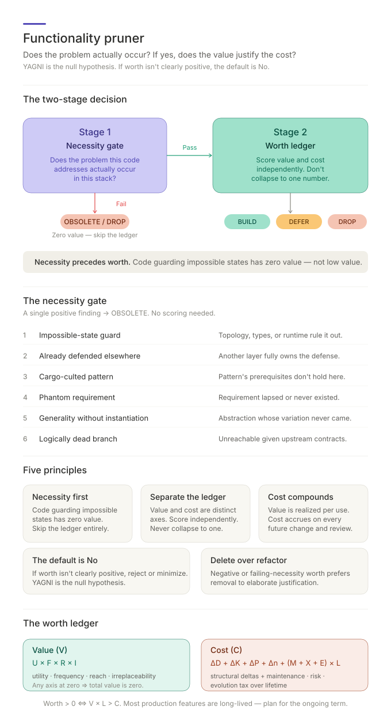

# Functionality Pruner

A first-principles SKILL for deciding whether a piece of functionality is worth keeping or building. Two stages: a **necessity gate** ("does the problem this code addresses actually occur in this stack?") followed by a **worth ledger** ("does the value justify the cost?").

> **Reporting vocabulary.** Cost-side phrases below (e.g. "Component-kinds Δ, Dependency-edges Δ, Max-chain-depth Δ, Module-count Δ") match the coder-facing fields defined in the **Reporting Vocabulary** section of [`structural-simplification`](../.claude/skills/structural-simplification/SKILL.md). The aggregate-cost formula below uses the internal symbols (`ΔD, ΔK, ΔP, Δn`) because it is math, not narrative.

## Why use this

- **"Just in case" code stops being inarguable.** Defensive checks against impossible states get a name (OBSOLETE) and a structural reason for safe removal or deprecation — not a budget debate.
- **Speculative features die before implementation.** YAGNI becomes the null hypothesis; high-cost work needs evidence, not enthusiasm.
- **Build and audit share a model.** A feature that would fail as a proposal today fails as existing code today.
- **Verdicts resist re-litigation.** "Removed because the problem cannot occur in this stack" closes the question; "removed because cost > value" reopens it whenever priorities shift.
- **Necessity findings beat usage data.** You don't need telemetry to prove product value for a code path that's structurally unreachable; you still check whether it documents an invariant or needs a migration path.
- **Outcome evidence closes the loop.** Current, linked measurements can revisit
  expected value without treating acceptance, deployment, or adoption as impact.

## Fundamental principles

Most code review collapses value and cost into a vibe ("this seems useful", "this seems heavy"). This skill separates them, and adds a gate before scoring even starts: **does the problem this code addresses actually exist in this stack?**

- **Necessity precedes worth.** Code guarding against architecturally impossible states has no product value for that failure mode. Skip the worth ledger; emit OBSOLETE unless it is the canonical executable invariant.
- **Separate the ledger.** Value and cost are distinct axes. Score independently; never collapse into one number.
- **Cost compounds, value decays.** Value is realized per use; cost accrues on every future change, test run, review, and incident.
- **The default is No.** If worth isn't clearly positive, reject or minimize. **YAGNI is the null hypothesis.**
- **Remove over refactor, refactor over rewrite.** A retrospective audit with negative or failing-necessity worth prefers safe removal or deprecation to elaborate justification.
- **Outcome evidence informs worth; M still decides.** Grounding owns hypothesis
  meaning, Traceability owns measurement state and freshness, and this skill owns
  the worth verdict.

## How to use

The skill has two modes: **prospective** (should we build this?) or **retrospective** (should we keep this?).

1. **Identify the subject.** A proposed feature, a defensive check that looks redundant, a feature flag that may have outlived its launch, an abstraction with one user.
2. **Prompt the AI.**

   > *Prospective:* "Apply functionality-complexity-tradeoff to this PRD: 'Add a client-version-check that warns users their tab is stale.' We deploy as a single SPA artifact."
   >
   > *Retrospective:* "Audit `src/auth/legacyTokenShim.ts` against functionality-complexity-tradeoff. We migrated to OAuth six months ago."

3. **Read the verdict.** The skill names the verdict (BUILD / BUILD-minimal / NEGOTIATE / DEFER / DROP for prospective; KEEP / SIMPLIFY / QUARANTINE / DEPRECATE / DELETE / OBSOLETE for retrospective) and the rationale.
4. **Apply the verdict.** Remove or deprecate the OBSOLETE check safely; ship the BUILD-minimal slice; instrument the QUARANTINE candidate; document the structural reason so a later audit doesn't reintroduce the same code.

For a post-release revisit, provide the canonical outcome hypothesis and its
current `requirements-traceability` record. `unmeasured`, `inconclusive`, or
`stale` evidence keeps the affected value claim Low unless independent current
evidence supports it. `supported` is bounded to its cohort, window, and
guardrails; `rejected` lowers the value claim but does not automatically dictate
DROP or DELETE.

## The necessity gate

Before scoring value or cost, walk the categories. A high-confidence positive finding routes the verdict to OBSOLETE (retrospective) or DROP-as-non-problem (prospective), subject to invariant-documentation and load-bearing exceptions.

| Category                              | Definition                                                              | Typical example                                                       |
|---------------------------------------|-------------------------------------------------------------------------|-----------------------------------------------------------------------|
| **Impossible-state guard**            | Defends against a state ruled out by topology, types, or runtime        | Client/server skew check in a single-artifact SPA                     |
| **Already-defended-elsewhere**        | Concern fully owned by another layer                                    | XSS-escape on top of an auto-escaping templating engine               |
| **Cargo-culted pattern**              | Pattern's prerequisites don't hold here                                 | Connection pool in a 200ms CLI; singleton in a stateless lambda       |
| **Phantom requirement**               | Solves a requirement that lapsed or never existed                       | Feature flag for a launch that completed                              |
| **Generality without instantiation**  | Abstraction whose anticipated variation never materialized              | Strategy pattern with one strategy                                    |
| **Logically dead branch**             | Unreachable given upstream contracts                                    | `if (!user.id)` after auth middleware that guarantees it              |

> The invariant audit is the highest-yield necessity check. List the invariants the architecture, type system, deployment topology, and trust boundary maintain. Then walk the branches with the list in hand.

## The worth ledger

Once necessity passes, score both sides independently. **Don't collapse to one number.**

- **Value (V):** `U × F × R × I` — utility, frequency, reach, irreplaceability. Any axis at zero means ordinary product value is zero; regulatory, safety, keystone, and invariant-documentation exceptions are handled separately.
- **Cost (C):** structural deltas (Component-kinds Δ, Dependency-edges Δ, Max-chain-depth Δ, Module-count Δ — delegated to `structural-simplification`) plus ongoing axes — maintenance (`M`), risk (`X`), evolution tax (`E`).
- **Worth > 0 ⇔ V × L > C_structural + (M + X + E) × L.** Most production features are long-lived; plan for the ongoing term.

Score 0–3 on each axis with one-line evidence. Record confidence (Low / Medium / High) per side. Low confidence → DEFER (prospective) or QUARANTINE (retrospective). OBSOLETE is exempt only when the necessity finding itself is high confidence.

When outcome evidence exists, the decision record cites hypothesis IDs, states,
freshness, and observation links. Authoritative legal, contractual,
accessibility, and safety floors remain source-driven and do not require a
product-value experiment.

## When to skip

Routine bug fixes inside a working module, content/copy edits, dependency bumps. The framework earns its keep on triage decisions, dead-code audits, "is this defensive check necessary?" reviews, and PR scope pushback.

## Next steps

- See [SKILL.md](../.claude/skills/functionality-complexity-tradeoff/SKILL.md) for the full reference (necessity-gate detection heuristics, worth axes, decision protocol, asymmetric trade-offs, output contract).
- For the structural complexity measurement consumed on the cost side — Component-kinds, Dependency-edges, Max-chain-depth, Module-count (internal symbols `D, K, P, n`) — see [`structural-simplification`](../.claude/skills/structural-simplification/).
- For the upstream principles (YAGNI, scope control, proportionality), see [`architecture-guidelines`](../.claude/skills/architecture-guidelines/).
- For hypothesis meaning, see [`requirements-grounding`](../.claude/skills/requirements-grounding/SKILL.md); for measurement links and freshness, see [`requirements-traceability`](../.claude/skills/requirements-traceability/SKILL.md).
- Run a retrospective audit on the next "just in case" check that lands in code review — the necessity gate often closes the question on the first pass.
