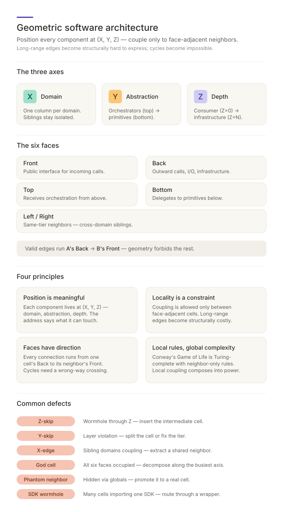

# Geometric Software Architecture

A 3-D spatial coordinate system for your dependency graph. Every component is placed at a **Domain / Tier / Layer** position and dependency coupling is routed through declared adjacent positions or named boundary adapters; long-range and forbidden cyclic dependencies become structurally hard to express — the way a building's geometry resists impossible plumbing.

> **Reporting vocabulary.** Terms like "Domain / Tier / Layer", "inbound interface", "outbound interface", "caller / callee / peer", and "layer-skip violation" match the coder-facing fields defined in the **Reporting Vocabulary** section of [`geometric-architecture` SKILL.md](../.claude/skills/geometric-architecture/SKILL.md). The internal model uses `(X, Y, Z)` coordinates and the six face names (Front / Back / Top / Bottom / Left / Right) underneath — see the Vocabulary section for the mapping.

## Why use this

- **Long-range coupling becomes structurally hard to express.** The grid resists layer-skip violations the way a building resists pipes that jump three floors.
- **Forbidden import cycles become structurally visible.** Cycles in an acyclic dependency projection require a connection that crosses an interface the wrong way.
- **Existing tangles can be diagnosed.** God components, layer-skip violations, and cross-domain coupling each surface as named defects with standard fixes.
- **Reasoning surface stays bounded.** Each component has a small declared neighbor set regardless of codebase size.
- **Established patterns become easier to maintain.** Clean architecture, DDD bounded contexts, and tiered abstractions are reinforced by the rule, not left as prose.

## Fundamental principles

Software is, by default, an unconstrained graph: any module may import any other module with a single line. The language offers no resistance to bad connections. Geometry imposes structure on the *vocabulary of connections* — the way physical space imposes structure on a building's plumbing.

- **Position is meaningful.** Each component lives at a **Domain / Tier / Layer** position — domain (bounded context), abstraction tier (orchestrator → primitive), layer (consumer → infrastructure). The position says where it belongs and what it may touch.
- **Locality is a constraint, not a guideline.** Coupling is routed through declared adjacent positions or named boundary adapters. Long-range edges become structurally expensive to express, not merely discouraged.
- **Interfaces have direction.** Every dependency connection runs from one component's outbound interface to a neighbor's inbound interface. Forbidden import cycles require an interface crossed the wrong way.
- **Global complexity emerges from local rules.** Conway's Game of Life is Turing-complete with a six-word ruleset and only nearest-neighbor interactions. Software does not need unrestricted coupling to be powerful — it needs well-structured local coupling that composes.

The geometry does more than *describe* the architecture: it gives lint and review a concrete shape to enforce.

## How to use

The skill has two modes: **audit** an existing dependency graph, or **design** the address of a new component.

1. **Identify the structure or proposal.** An existing tangle to diagnose, or a new component whose position you need to assign.
2. **Prompt the AI.**

   > *Audit:* "Diagnose the dependency graph in `src/`. Flag layer-skip violations, cycles, god components, and cross-domain coupling."
   >
   > *Design:* "Where does `OrderShipmentNotifier` belong — what Domain / Tier / Layer? It's currently imported by both the order and notification domains."

3. **Read the verdict.** The skill names the defect (layer-skip violation, cross-domain coupling, god component, hidden coupling) and gives the standard fix.
4. **Apply the fix.** Add the missing intermediate component, introduce a boundary adapter, extract a shared neighbor, or decompose the god component along its busiest axis.

## The three axes and six interfaces

The internal model places every component at a `(X, Y, Z)` coordinate; reports speak of the same three concerns as **Domain / Tier / Layer**.

### Axes — where a component lives

| Axis  | Architect term          | Encodes                                              | Direction                                                              |
|-------|-------------------------|------------------------------------------------------|------------------------------------------------------------------------|
| **X** | **Domain**              | Bounded context                                      | One column per business domain; siblings stay isolated.                |
| **Y** | **Abstraction tier**    | Orchestrator → primitive                             | Orchestrators (top) → primitives (bottom).                             |
| **Z** | **Layer**               | Consumer → infrastructure (environment depth)        | Consumer (Z=0) → infrastructure (Z=N). Dependency arrows point toward declared dependency surfaces; imports may point the opposite way under dependency inversion. |

### Interfaces — how a component connects

| Internal face  | Architect term            | Role                                                       |
|----------------|---------------------------|------------------------------------------------------------|
| **Front**      | **Inbound interface**     | Public surface through which callers enter.          |
| **Back**       | **Outbound interface**    | Outward calls, I/O, infrastructure access.                 |
| **Top**        | **Caller face**           | Receives orchestration from above.                         |
| **Bottom**     | **Callee face**           | Delegates to primitives below.                             |
| **Left/Right** | **Peer / sibling face**   | Same-tier neighbors (cross-domain siblings).               |

A dependency connection is valid when **one component's outbound interface connects to a neighbor's inbound interface** (Back → Front in the internal model) through an allowed adjacent position or named boundary adapter. Anything else is a direction violation. Intentional runtime cycles such as event loops or state machines are modeled as runtime behavior, not static import edges.

## Common defects

The geometry names certain connection defects. When one appears, the violation has a standard fix candidate.

| Defect                       | Reading                                                         | Standard fix                                                    |
|------------------------------|-----------------------------------------------------------------|-----------------------------------------------------------------|
| **Layer-skip violation**     | Skipping a layer through Z (e.g. controller → repository).      | Insert or use the intermediate component, or declare the boundary adapter that owns the jump. |
| **Tier-skip violation**      | Lower abstraction tier reaching a higher one.                   | Split the component or fix the tier boundary.                   |
| **Cross-domain coupling**    | Sibling domains coupling directly.                              | Extract a shared neighbor on the domain boundary or route through an existing published interface. |
| **God component**            | All six faces occupied; the component does too much.            | Decompose along the axis with the most edges.                   |
| **Hidden coupling**          | Implicit linkage via globals or runtime registries.             | Promote the implicit dependency to a real component with a position. |
| **External-SDK proliferation** | Many components importing the same external SDK directly.     | Route through a single wrapper component.                       |

When a rule fires, it is not the lint catching a typo — it is the dependency graph violating its declared shape.

## When to skip

Routine logic inside existing modules, bug fixes, content edits, CSS-only changes, dependency bumps, trivial renames. The framework earns its keep when the dependency graph itself is being shaped or diagnosed.

## Next steps

- See [SKILL.md](../.claude/skills/geometric-architecture/SKILL.md) for the operational reference (full failure-mode table, ESLint mechanism mapping, lint can/cannot-enforce list, rollout strategy).
- For first-principles rules on what goes inside a module, see [`architecture-guidelines`](../.claude/skills/architecture-guidelines/).
- For evaluating whether a structural change actually reduces complexity, see [`structural-simplification`](../.claude/skills/structural-simplification/).
- Run an audit on the subsystem you suspect is most tangled — the verdict often names the geometric defect on the first pass.
