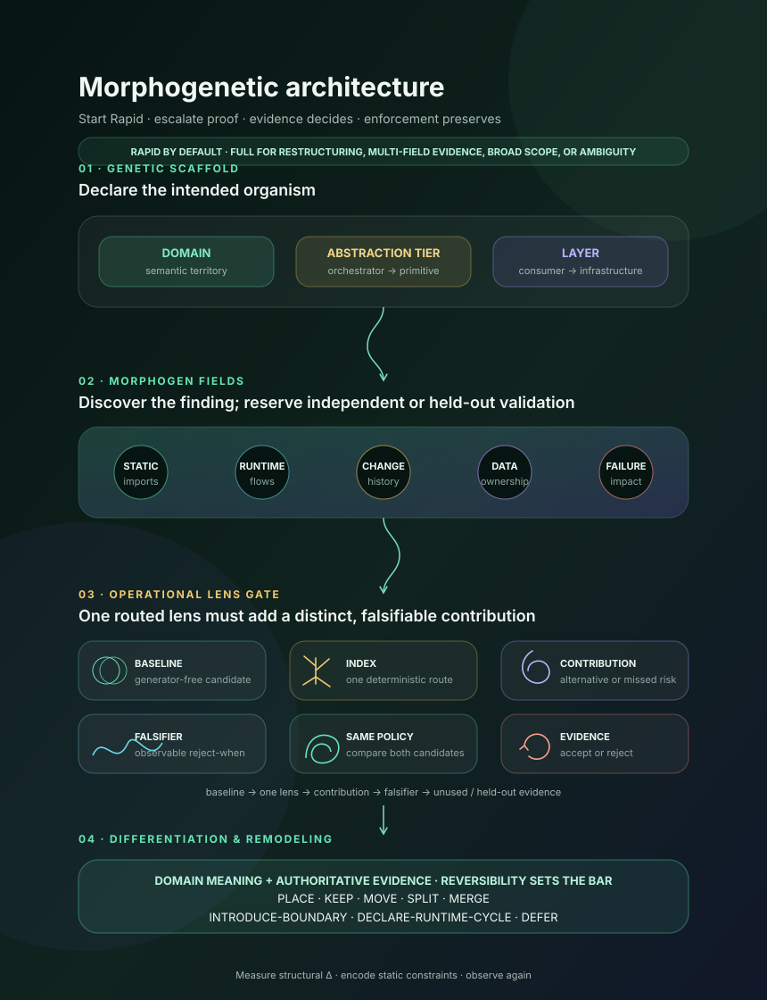

# Morphogenetic Architecture



Design software topology as a declared structure that can be tested and evolved.
Start with a bounded Rapid scan, place each component at a
**Domain / abstraction tier / layer** position, and escalate to Full when the
decision requires restructuring, multi-field evidence, broad scope, or
resolution of ambiguity. Full analysis compares that intent with static
dependencies, runtime flow, co-change, shared-data, and failure-propagation
evidence. A fitting natural system can then provide a visible
candidate-generating lens: nature proposes; software evidence decides.

The operational source is
[`morphogenetic-architecture` SKILL.md](../.claude/skills/morphogenetic-architecture/SKILL.md).

## Why use this

- Preserve the original locality guarantees: explicit interfaces, bounded
  neighbor sets, no forbidden static cycles, and no unowned layer jumps.
- Keep simple placement and static-edge checks fast, while escalating
  automatically before any restructuring decision.
- Detect architecture that looks clean in imports but is coupled through event
  buses, registries, shared schemas, coordinated changes, or cascading failures.
- Discover candidate boundaries from evidence without letting an algorithm
  redefine domain meaning.
- Distinguish static dependencies, which remain directed and acyclic, from
  legitimate runtime feedback loops, which must be named and bounded.
- Place or evolve a component through an explicit PLACE, KEEP, MOVE, SPLIT, MERGE,
  INTRODUCE-BOUNDARY, DECLARE-RUNTIME-CYCLE, or DEFER decision.

## The model

```text
Mode selector
  Rapid by default for bounded placement and static checks
  Full for restructuring · multi-field evidence · broad scope · ambiguity
             ↓
Declared topology
  Domain / abstraction tier / layer
  Inbound and outbound interfaces
  Allowed static neighbors
             ↓ compare
Observed fields
  Static imports and package edges
  Runtime calls and messages
  Co-change history
  Shared-data ownership
  Failure propagation
             ↓ declare + compute
Decision policy + reproducible graph analysis
  baseline · threshold · window · sensitivity · input/result hashes
             ↓ interpret
Natural pattern atlas
  mechanism → software match → candidate → break point
             ↓ evidence decides
PLACE / KEEP / MOVE / SPLIT / MERGE / INTRODUCE-BOUNDARY /
DECLARE-RUNTIME-CYCLE / DEFER
```

Keep the observed fields separate. Traffic counts, shared commits, schema
ownership, and incident impact have different meanings and units; combining
them without a declared weighting policy creates false precision.

## How to use

The selector starts in Rapid unless the request already requires Full. Use a
bounded design request for a new component:

> Place `OrderShipmentNotifier`. Declare its Domain / abstraction tier / layer,
> inbound and outbound interfaces, allowed static dependencies, and any runtime
> feedback loop.

This can finish in Rapid with PLACE, KEEP, DECLARE-RUNTIME-CYCLE, or DEFER.
Rapid escalates to Full when MOVE, SPLIT, MERGE, or INTRODUCE-BOUNDARY becomes
a candidate; when non-static evidence affects the decision; when scope crosses
several components or a material boundary; or when placement remains
ambiguous.

Use a Full audit when declared structure may have drifted:

> Audit `src/checkout`. Compare imports, traces, six months of co-change, shared
> schemas, and incident propagation with the declared domain boundaries.

An explicit `rapid` or `quick` request selects only the starting mode; it cannot
waive an escalation. Once Full begins, missing evidence is reported as
**Not measured** and produces DEFER when required proof is unavailable.

Every result also exposes:

```text
Analysis mode:    <Rapid | Full | Rapid → Full>
Selection reason: <bounded static check | explicit Full request | escalation condition>
Decision policy: <field + baseline + threshold + window + sensitivity>
Graph analysis:  <script/tool + version + input/result hash | Not measured>
Natural lens: <pattern | none | inspiration only>
Transfer:     <mechanism → candidate; break point; evidence accepted/rejected it>
```

## Important distinctions

- **Requirements topology** structures requirements and their prerequisites.
  Morphogenetic Architecture places implementation components.
- **Architecture guidelines** decide what belongs inside a component.
  Morphogenetic Architecture decides where it belongs and what may connect.
- **Structural simplification** measures complexity deltas for a proposed
  topology change.
- **Architecture as code** encodes deterministic static dependency constraints.

## Reproducible graph analysis

Weighted evidence cannot be narrated into existence. Before generating a cut,
declare a per-field baseline, metric, threshold, evidence window, minimum group
size, and sensitivity rule. Then run the bundled deterministic analyzer:

```text
python scripts/analyze_evidence_graph.py graph.json --pretty
```

It computes directed SCCs, spectral/Fiedler candidate cuts, normalized cut,
conductance, and deterministic perturbation sensitivity. Its hashes bind the
result to the exact input. The output deliberately reports
`architecture_decision: NOT_EVALUATED`: an eligible cut still needs domain
meaning and an independent observed field.

If no executable output exists, graph analysis is **Not measured**. If a policy
is missing, fitted after inspecting a preferred cut, or unstable under its
declared sensitivity rule, the architecture decision is **DEFER**.

## Natural pattern atlas

The natural systems are active reasoning tools, not a decorative afterword:

| Natural architecture | Software question it helps ask |
| --- | --- |
| **Cell differentiation** | Should one component specialize or split because its position and signals imply different responsibilities? |
| **Reaction–diffusion** | Can small activation/inhibition rules create coherent global boundaries? |
| **Phyllotaxis / Fibonacci** | How should repeated peers grow around a constrained coordinator without crowding? |
| **Hierarchical branching** | Which named trunks or adapters should distribute access into local twigs? |
| **Physarum transport** | Which valuable paths should strengthen, and which demonstrably unused edges can be pruned? |
| **Leaf venation** | Where is a runtime loop worth its cost because it provides measured resilience? |
| **Homeostasis** | Does a feedback cycle have a setpoint, bound, owner, exit, and observability? |
| **Bone remodeling** | Is pressure persistent enough to justify changing the structure? |
| **Cymatics / Chladni figures** | Do repeated frequency or time-window sweeps reveal stable low-pressure nodal boundaries? |

The transfer is deliberately asymmetric. A natural mechanism may suggest where
to look and what candidate to test, but it cannot count as boundary evidence.

### Fibonacci, sacred geometry, and cymatics

Keep the beauty. Use circles to discuss ownership, overlaps to expose shared
concerns, spirals to show iterative growth, branches to show distribution,
lattices to show peer symmetry, and nodal lines to visualize quiet candidate
boundaries.

Keep the epistemic boundary too. Golden ratios, Fibonacci counts, fractal depth,
and sacred figures are `inspiration only` unless the software shares the
natural system's measurable mechanism, objective, and constraints. A beautiful
shape never supplies the domain reason or independent observed field required
for a topology change.

## Next steps

- Read the
  [Rapid topology scan](../.claude/skills/morphogenetic-architecture/references/rapid-topology-scan.md)
  whenever the selector starts in Rapid; preserve its completed checks if the
  task escalates to Full.
- Read
  [evidence-fields.md](../.claude/skills/morphogenetic-architecture/references/evidence-fields.md)
  before using telemetry, history, weighting, or graph partitioning.
- Read
  [graph-analysis.md](../.claude/skills/morphogenetic-architecture/references/graph-analysis.md)
  and use the bundled analyzer before reporting SCCs, spectral cuts, cut
  metrics, or sensitivity.
- Use the
  [natural pattern atlas](../.claude/skills/morphogenetic-architecture/references/natural-pattern-atlas.md)
  to select a mechanism, state its software match and break point, and generate
  one evidence-testable candidate.
- Use
  [`structural-simplification`](../.claude/skills/structural-simplification/)
  before accepting MOVE, SPLIT, MERGE, or INTRODUCE-BOUNDARY.
- Hand static dependency constraints to
  [`architecture-as-code`](../.claude/skills/architecture-as-code/).
