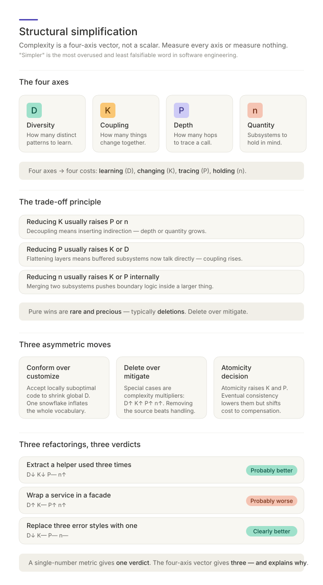

# Structural Simplification — Companion

> **Companion to [`SKILL.md`](../.claude/skills/structural-simplification/SKILL.md).** Read SKILL.md first — that is the
> canonical operational reference (the four-axis model, reduction operations,
> trade-off matrix, asymmetric trades, decision protocol). This file argues
> _why_ the model has four axes and not one, walks through worked examples, and
> explains the framing of measurement-as-discipline. It does not repeat
> definitions; it justifies them.

> **The core claim:** "Simpler" is the most overused and least falsifiable word
> in software engineering. Every refactor claims to simplify. Most refactors
> merely relocate complexity from one place to another. Without a measurable,
> multi-axis definition of complexity, any change can be argued either way — and
> the loudest voice wins. This skill makes complexity measurable, comparable,
> and honest.

> **Reporting vocabulary & notation.** This companion argues *why* the model
> has the shape it does, so it uses the model's internal axis symbols
> (`D, K, P, n` and the compact movement notation `D↓ K↑ P— n↑`) in worked
> examples and trade-off explanations. In reports the model produces, the
> same four axes are called **Component-kinds Δ, Dependency-edges Δ,
> Max-chain-depth Δ, Module-count Δ** — see the **Reporting Vocabulary**
> section of [`SKILL.md`](../.claude/skills/structural-simplification/SKILL.md)
> for the mapping. Treat any bare-symbol narrative below as describing the
> model itself, not the coder-facing output.

---

## 1. Why "simpler" fails as an argument

When two engineers disagree about whether a refactor simplifies a system, they
almost always turn out to be measuring different things. One says "this is
simpler — there are fewer files." The other says "this is more complex — the
dependency chain is longer." They are both right. They are talking about
different axes of complexity, but using the same word.

This is why simplification debates go in circles. The word "simpler" presupposes
a single measurable thing. There isn't one. Complexity is not a scalar — it is
at least a four-dimensional vector. Without separating the dimensions, every
claim about simplification is unfalsifiable: someone can always point to the
axis that improved and ignore the ones that worsened, and someone else can do
the opposite.

The skill exists to end that argument. By forcing every restructuring to declare
its effect on **each axis separately**, it converts a vague rhetorical claim
into a measurable, comparable proposition.

---

## 2. The single-number trap

The temptation when measuring complexity is to collapse everything into a single
score — cyclomatic complexity, lines of code, file count, or some weighted
composite. That is useful for dashboards, but it fails as a refactoring verdict
when it hides which axis improved and which axis worsened.

**First, the axes correlate but are not identical.** More parts (n) usually
means more diversity (D) and more depth (P). But the correlation is imperfect.
You can have many parts with low diversity (a uniform array) or few parts with
high diversity (a small but heterogeneous mess). A composite score double-counts
the shared variance and obscures the independent variation that matters.

**Second, the trade-offs are real.** Most architectural moves _raise_ one axis
to _lower_ another. Adding an abstraction tier reduces coupling but increases
chain depth and module count. Flattening two tiers reduces depth but raises coupling.
Extracting a common part reduces diversity and coupling but adds quantity. A
composite score erases these trade-offs by averaging — which is exactly the
information you need to preserve.

The four axes correspond to four irreducibly different costs: **learning,
changing, tracing, and holding**. A system can be cheap on some axes and
expensive on others. The job of architecture is to manage the _vector_, not
minimize a scalar.

---

## 3. Worked example: three refactorings of the same starting point

The axes are conceptually independent — moving along one does not determine
motion along the others — even though they correlate in practice. Independence
is what makes per-axis comparison rigorous. Consider three refactorings of the
same starting point:

- **Extract a helper used three times.** D↓ (one fewer pattern shape), K↓ (three
  direct dependencies become one shared dependency), P— (no new tier or chain hop), n↑ (one
  new function). Net: probably better.
- **Wrap a service in a facade.** D↑ (a new interface kind), K— (same actual
  coupling), P↑ (one more hop on every call), n↑ (one more part). Net: probably
  worse — and crucially, the facade _hides_ P without reducing it.
- **Replace three error-handling styles with one.** D↓ (substantial), K—, P—, n—
  (or slight ↓ if shared utility consolidates). Net: clearly better, with no
  compensating cost.

A single-number metric would produce one verdict for all three. The four-axis
vector produces three different verdicts — and explains _why_. The verdicts are
not just outputs; they are diagnostic. They tell you _which axis_ you bought
improvement on and _which_ you paid for it on.

---

## 4. The trade-off principle: why pure wins are rare

Most architectural moves are not pure wins — they shift complexity along the
axis-vector. Three patterns recur:

- **Reducing K usually raises P or n.** Decoupling means inserting indirection,
  extracting interfaces, or splitting things. Each of those adds depth or
  quantity.
- **Reducing P usually raises K or D.** Flattening tiers means the parts that
  were buffered by the tier now talk to each other directly — coupling rises.
  Or the merged parts grow in shape diversity.
- **Reducing n usually raises K or P internally.** Merging two parts into one
  means whatever they used to do across a boundary now happens inside a larger
  thing — internal complexity rises.

The trade-off principle has a corollary: **moves that improve one axis without
degrading any other are rare and precious**. When you find one, take it. They
are often removals: deleting a feature, eliminating a special case, dropping an
unused abstraction. Deletions can improve every structural axis simultaneously
when the removed part is not load-bearing and the migration path is safe, which
is why "remove over mitigate" is a powerful directive in the SKILL.

Merges carry one more bound that the axis-vector alone does not show:
**referencing-list uniformity**. Vocabulary items — rights, routes, types,
statuses, config keys — are often referenced by other lists (ban/allow lists,
separation-of-duties pairs, fixed scopes). A merged item cannot be half-banned
or half-granted, so a merge is only safe when every member is uniform with
respect to every list that references it; one non-uniform member forces it to
stay separate.

---

## 5. Asymmetric trades: why local cost can be a global win

Three asymmetric moves are powerful enough to deserve their own treatment in the
SKILL. Each violates naive "minimize-everywhere" intuition. Each accepts a local
cost to win a larger global gain.

**Conform when semantics match.** When a system has nine uniform components and
one snowflake, the snowflake can inflate D disproportionately — it is the reason
readers have to learn an extra pattern. Moving the snowflake into the existing
shape can produce _locally suboptimal_ code, but globally D drops and the
vocabulary shrinks. That trade only works when the standard shape fits the same
semantics, lifecycle, ownership, and constraints; a real domain distinction
should be named, not paved over.

**Remove over mitigate, safely.** Special cases are complexity multipliers. A
single edge case can force unique patterns (D↑), conditional paths (K↑),
extended chains (P↑), and supporting parts (n↑). The cost of a feature is rarely
only the feature itself — it is every special case the feature forces elsewhere
in the system. When the feature is low-utility, nonessential, and safe to
migrate away from, removal is often the strongest simplification move.

**Atomicity decision.** When an operation spans multiple systems, the atomicity
choice has direct structural cost. Atomicity raises K and P (the parts must
coordinate, the chain extends). Eventual consistency lowers K and P (the parts
proceed independently) but transfers complexity to compensation logic and
partial-failure documentation. The mistake is implementing the operation
_without making this choice consciously_ — at which point the structural cost
lands somewhere accidental and uncontrolled.

---

## 6. Measurement as discipline

The decision protocol in the SKILL is deliberately mechanical. The mechanical
nature is the point. Without the protocol, "this is simpler" is a feeling — and
feelings are reliably partisan. With the protocol, "this is simpler" becomes a
claim with a structure: it asserts specific values for **Component-kinds Δ,
Dependency-edges Δ, Max-chain-depth Δ, and Module-count Δ**, and it can be
challenged on any of them. The conversation moves from "I think this is cleaner"
to "you reduced dependency-edges by 0.3 but raised max-chain-depth from 4 to 6
and added two parts — what was the net intent?"

This is the same shift that made other engineering disciplines mature: from
intuition to instrumentation. You cannot improve what you do not measure. And in
architecture, the thing to measure is not a scalar — it is the four-axis vector
of structural complexity.

The model does not make architecture easier. It makes architecture _more
measurable_.
The hard part — knowing where to cut, which axis to spend, what to delete —
remains. But the conversation about whether a change is genuinely a
simplification stops being only a matter of opinion. It becomes an explicit
comparison of a four-dimensional vector plus the non-structural constraints the
system still has to satisfy.
