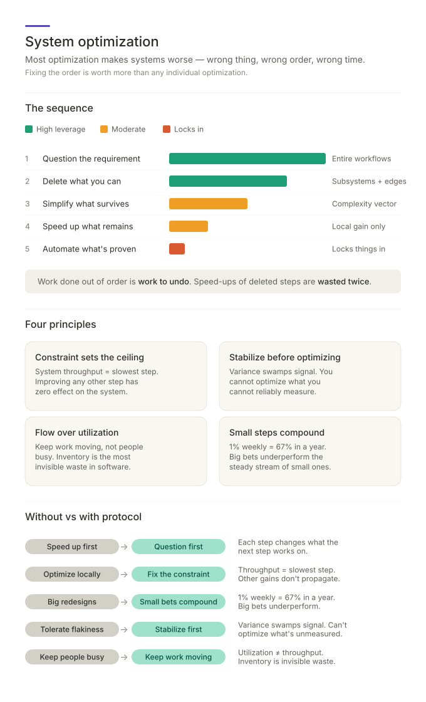

# System Optimization — In-Depth Explanation

> **Companion to [`SKILL.md`](../.claude/skills/system-optimization/SKILL.md).**
> Read SKILL.md first for the operational protocol; this primer explains why
> the sequence matters.

> **The core claim:** Most optimization effort makes systems worse — because it
> speeds up the wrong thing, in the wrong order, at the wrong time. The single
> most expensive mistake in optimization is doing the right things in the wrong
> sequence: optimizing what should have been deleted, automating what should
> have been simplified, parallelizing what should have been questioned. This
> skill enforces the sequence.

---

## 1. The Order Problem

Optimization has a sequence. Most teams ignore it.

The default reflex when something is slow is to _speed it up_: add a cache,
parallelize the stage, throw hardware at it, write a faster algorithm. The
default reflex when something is repetitive is to _automate it_: write a script,
build a tool, install a bot. Both reflexes feel productive — they produce
visible artifacts, they show up in commit logs, they can be demonstrated in a
standup.

But both reflexes share a risky property: they can **lock in whatever they touch**.
A cached step is harder to remove than an uncached one. An automated workflow
becomes infrastructure that people depend on. Once a thing is fast or automated,
the question "did this need to exist at all?" becomes politically expensive to
ask. The investment creates its own justification.

The correct order — **question, probe deletion, simplify, speed up, automate** —
exists because each step changes what the next step is even working on. Question
the requirement and you may discover the entire workflow is unnecessary; you've
just saved every downstream step. Probe deletion and the remaining optimization
target shrinks without silently removing load-bearing behavior. Simplify what
survives and the speed-up becomes clearer. Only at the end, when you know the
work is necessary, simplified, and stable, does automation become safe — because
at that point you are automating something worth automating.

Work done out of order is work to undo. Every speed-up of a step that should
have been deleted is wasted twice: once doing it, once removing it.

---

## 2. The Most Upstream Waste Is the Requirement Itself

You cannot out-optimize unnecessary work. No amount of caching, parallelism, or
clever tooling will recover the cost of doing something that did not need to be
done. This sounds obvious — and yet most optimization sessions skip it, because
questioning a requirement feels like a different kind of work than optimizing
it. It feels like _not doing the job_.

It is the job. The cheapest possible step is the one that no longer needs to
exist. Every step a team performs has an origin — a ticket, a process, a
convention, a habit, a long-departed colleague who once said "we should always
do this." Many of those origins no longer apply. The system has changed; the
requirement has not been re-examined since. The step survives by inertia.

Stripping a requirement to first principles is uncomfortable because it requires
saying "no" — to a stakeholder, to a past decision, to one's own prior work. But
it is the highest-leverage move available. A single deleted requirement removes
itself, every step that produces it, every step that consumes it, every test
that validates it, every document that describes it, and every monitor that
watches it. One question can collapse a column of the value stream.

Questioning a requirement rarely means discarding it wholesale. Separate its
**obligation** — the outcome, evidence, or restriction that must exist — from
its **mechanism** — the specific rights, routes, roles, record types, or
protocols it names. Obligations are floors. Pinned mechanism is negotiable
waste: establish the floor within the current requirements first, then propose
careful requirement edits scored like any change, and gate the ones with real
external trade-offs as explicit product decisions.

The skill places this step first because **it is the only step that gets less
likely the longer you wait**. Once optimization or automation has been invested
in a workflow, the workflow becomes harder to delete — not because the
underlying need has changed, but because the sunk cost has.

---

## 3. Why Deletion Is the Highest-Leverage Move

Deletion is the only move in the optimization toolkit that improves every axis
simultaneously. Removing a part drops quantity (n), shrinks the vocabulary (D),
severs every relationship the part was involved in (K), and shortens any chain
it sat on (P). Connect this to the four-axis complexity model in
`structural-simplification` and the math becomes explicit: **elimination scales
as K × n²** — every potential edge to the deleted part disappears with it.

No other operation has this property. Refactoring trades complexity across axes.
Abstraction reduces one axis at the cost of another. Simplification moves
complexity from where it hurts to where it doesn't. Deletion alone _reduces
total complexity_ without compensating cost.

Yet deletion is rare in practice, for two reasons. The first is fear: removing
something that was once needed feels riskier than leaving it in place. The
second is invisibility: deleted code produces no commit message worth bragging
about. Engineers are rewarded for things they built, not things they removed.

The skill counters both by making deletion a reversible probe rather than a
heroic act. Remove candidates behind a branch, feature flag, dry run, narrow
rollout, or explicit rollback plan. Observe what breaks, restore anything
proven load-bearing, and keep only removals backed by evidence. A deletion pass
that removes only obviously dead pieces may still be useful, but it has not
tested the expensive middle ground: things that look alive but no longer carry
current requirements.

---

## 4. The Constraint Sets the Ceiling

The Theory of Constraints contributes the single most under-applied principle in
software optimization: **the system's throughput is set by its current
constraint, and improving non-constraints often has little or no system effect**.

This is counterintuitive because local optimization always _measurably_ helps
the local stage. The build step is 30% faster, the test phase parallelizes, the
deployment script trims two minutes. Each change is real. The system throughput
may stay unchanged because the actual constraint is somewhere else (usually
code review, manual approval, or a flaky integration test that re-runs three
times). The local wins do not always propagate.

Worse, local optimization away from the constraint can _hurt_ the system.
Speeding up a stage that feeds the bottleneck just builds inventory in front of
it: more queued PRs, more pending deployments, more work-in-progress that ages
and goes stale. The bottleneck's queue gets longer; the system's flow gets
worse, not better.

The five-step ToC protocol — identify, exploit, subordinate, elevate, repeat —
exists to break this pattern. _Identify_ forces you to find the actual
constraint, not the convenient one. _Exploit_ squeezes maximum output from it
before adding resources, because adding resources to a poorly-utilised
constraint just multiplies waste. _Subordinate_ means aligning upstream work to
the constraint's capacity: reducing work-in-progress, batching less, limiting
intake, or changing priorities. It does not mean blindly slowing every upstream
stage.

The hardest step is _repeat_. After fixing one constraint, the limiting factor
may move — and teams routinely miss the handoff. They keep optimizing the old
constraint (now no longer the bottleneck) out of habit, while another queue
accumulates. Every Kaizen cycle must explicitly re-identify where the constraint
is now.

---

## 5. Stability Before Optimization

Six Sigma contributes a principle that is almost universally violated in
software: **you cannot meaningfully optimize an unstable process**.

Optimization is measurement. Measurement requires signal exceeding noise. A
process that varies wildly run-to-run produces noise that swamps the signal of
any improvement attempt. You make a change; the process is faster; was that the
change, or was it the natural variance? You make another change; the process is
slower; same question. Without stability, every "improvement" is a coin flip
dressed up as engineering.

In software, instability shows up as flakiness. Flaky tests. Flaky CI pipelines.
Builds that succeed on retry. Deploys that work on Tuesdays. These are not
annoyances — they are _measurement-blockers_. Every flaky stage in the pipeline
is a layer of noise between you and any data you might use to optimize.

The directive is deliberate: **stabilise before optimising**. Find the
sources of variance. Eliminate them. Make the process boring and repeatable.
Only then does optimization become tractable, because only then can you
distinguish "this change made it faster" from "this change happened to occur on
a fast day."

This is also why the skill treats flakiness as a defect rather than an
operational nuisance. A flaky test is not just a small cost per run — it is a
large cost on the entire optimization programme that depends on the pipeline
producing trustworthy signals.

The operational test the skill adds is the distinction between **common-cause**
variation — the inherent run-to-run noise of a stable process — and
**special-cause** variation — an assignable, out-of-bounds event. Reacting to
common-cause noise as though it were signal (tampering) _adds_ variance rather
than removing it. The discipline is to establish a baseline band first and treat
only out-of-band moves as regressions worth chasing.

---

## 6. Flow Over Utilization

Lean contributes the realization that **keeping people busy is not the goal —
keeping work moving is**. The two goals look similar from the outside and are
opposed on the inside.

Utilization optimisation says: every engineer should always have something to
work on. The result is that work-in-progress accumulates. PRs sit waiting for
review while the author starts the next ticket. Branches grow stale.
Half-finished features queue. Each individual is busy; the system is full of
inventory.

Flow optimisation says: every piece of work should always be moving. The result
is that engineers occasionally have to pause new work to unblock old work —
finish a review, ship a half-done feature, kill a stalled branch. The individual
utilisation drops; the system throughput rises, because nothing is sitting
still.

The TIMWOODS waste taxonomy makes this trade-off concrete. **Inventory** — PRs,
branches, queued alerts, unread reports — is the most invisible form of waste in
software. It produces no error messages. It does not slow down any single step.
It just accumulates, ages, and quietly costs more to clear with every passing
day. The skill's directive — flag every step where wait time exceeds cycle time
— is a direct measurement of inventory: if a unit of work spends more time
waiting than being acted upon, the system is inventory-bound.

Two laws make this quantitative. **Little's Law** (`cycle time = WIP /
throughput`) says the fastest lever on delivery time is usually cutting
work-in-progress, not speeding up individual steps. The **utilization curve**
says wait time climbs non-linearly as a resource approaches full load — past
roughly 80% it explodes — so a resource pinned at 95% is not efficient but a
delay generator. Driving every person or runner to full utilization is precisely
how a system fills with the inventory this section warns against.

This is why **small PRs and short feedback loops** are not stylistic
preferences. They are inventory controls. A small PR clears the system quickly;
a large PR sits in review queue and ages. A short test feedback loop keeps work
moving; a long one creates work-in-progress while the engineer context-switches.
Every workflow choice has a flow cost.

---

## 7. Build Quality In, Shift Left

DevOps contributes the principle that **defects are cheaper the closer they are
caught to their source**. The cost curve is exponential, not linear. A type
error caught by the IDE costs seconds. The same error caught by CI costs
minutes. Caught by integration test, hours. Caught in production, days or weeks
— and that's before counting the cost of the production incident itself.

This produces a clear directive: **embed quality at the source**, via types,
linters, formatters, static analysis, and automated tests that run before the
code leaves the developer's machine. Every quality gate that can run _earlier_
without losing required context should run earlier. Every check that runs only
in CI when it could also run locally is a cost multiplier — every developer who
pushes a broken build pays the CI roundtrip cost that a local check would have
prevented.

The shift-left principle has a corollary that is widely misunderstood:
_detection distance matters alongside detection coverage_. A test pyramid
optimised for line coverage but weighted toward end-to-end tests catches many
defects far from their source. A pyramid weighted toward unit and contract tests
often catches defects where they are cheaper to fix, while reserving
integration and end-to-end tests for failures that require real boundaries or
full workflows.

The skill's framing — "confidence over coverage" — captures this exactly. The
goal is not to test every line; it is to be confident in the critical paths.
Coverage is a means; confidence is the end.

---

## 8. Small Steps Compound

Kaizen contributes the mathematical observation that **many small validated
improvements compound faster than infrequent large redesigns**. Compounding
beats magnitude when the time horizon is long.

A 1% improvement applied weekly for a year produces a 67% improvement. A single
30% redesign every two years, even if it lands on schedule, produces less — and
almost no large redesign lands on schedule, because the variance on large
changes is enormous. Some succeed; many fail; on average the big bet
underperforms the steady stream of small bets.

The PDCA cycle — Plan, Do, Check, Act — exists to make small improvements
_validated_. Every change is a hypothesis: "I believe this change will improve
X." The Check step is the experiment: did X actually improve? If yes, keep the
change and look for the current constraint. If no, revert or revise and try
something else.
Without the check, you accumulate untested changes that each individually claim
to be improvements but whose net effect is unknown.

The skill closes the loop by tying every optimization back to the four-axis
complexity model: **if a change worsens any axis (D, K, P, n) without improving
flow, reliability, cost, or another complexity axis, it is not an
optimization**. This is the litmus test. It catches the
most common failure of well-meaning improvement work — the "optimization" that
adds a clever caching layer (n↑, K↑, P↑) without actually reducing any cost the
system was paying. The four-axis test makes the trade-off visible before it
ships.

---

## 9. Summary: What the Optimization Protocol Gives You

| Property                 | Without protocol                       | With protocol                                    |
| ------------------------ | -------------------------------------- | ------------------------------------------------ |
| **Order of work**        | Speed up first, regret later           | Question -> Probe deletion -> Simplify -> Speed -> Automate |
| **Unnecessary work**     | Optimised and locked in                | Removed before any optimisation cost is incurred |
| **Deletion attempts**    | Rare, conservative, low-yield          | Reversible, evidence-backed probes               |
| **Local optimization**   | Celebrated regardless of system effect | Subordinated to the system constraint            |
| **Constraint awareness** | Lost after first fix                   | Re-identified every cycle                        |
| **Process variance**     | Treated as an operational nuisance     | Treated as a measurement-blocker                 |
| **Flaky tests**          | Tolerated, retried                     | Defects: fixed, quarantined with owner/deadline, or replaced |
| **Work-in-progress**     | Invisible, accumulating                | Measured: wait time vs cycle time                |
| **Defect detection**     | Late, expensive, in production         | Early, cheap, at the source                      |
| **Quality gates**        | In CI by default                       | Shifted as far left as possible                  |
| **Improvement strategy** | Big-bang redesigns                     | Small validated changes that compound            |
| **Optimization claims**  | Unverified, locked in                  | Hypothesis-tested, axis-checked, reversible      |

The protocol does not make optimization easier. It makes optimization _honest_.
The hard parts — questioning what people built, deleting what people use,
slowing down the wrong stages, accepting that the constraint moved — remain. But
the conversation about whether a change is genuinely an improvement stops being
a matter of effort or visibility. It becomes a matter of sequence, measurement,
and the four-axis test.

That is the entire claim of the skill: **most systems are not under-optimized —
they are optimized in the wrong order, on the wrong axis, at the wrong stage.
Fixing the order is worth more than any individual optimization.**
