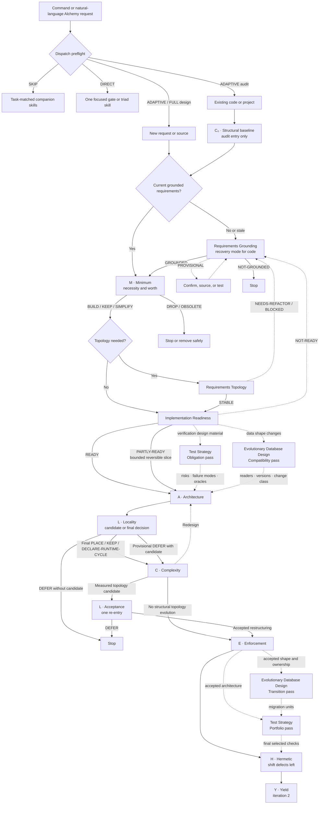

# Adaptive A.L.C.H.E.M.Y. Pipeline Design

Status: Implemented
Scope: A.L.C.H.E.M.Y. orchestration
Mode: Design
Decision: Proceed with the adaptive A.L.C.H.E.M.Y. pipeline
Blocking stage: None
Verification: `npm run validate`; package dry-run; mirror and pipeline-order checks

## Purpose

Provide one cheap command or natural-language entrypoint that classifies work
before loading gate skills, then integrate `requirements-grounding`,
`requirements-topology`, and
`implementation-readiness` into A.L.C.H.E.M.Y. without changing the acronym,
weakening the existing gates, or forcing every request through a longer linear
pipeline.

The requirements skills form a conditional **Requirements Qualification
Phase** that spans the Minimum gate and precedes architectural design:

1. `requirements-grounding` establishes whether the problem, actors, scope,
   sources, and evidence are trustworthy, and records linked outcome hypotheses
   when downstream impact is decision-relevant.
2. A.L.C.H.E.M.Y. **M — Minimum** decides whether grounded functionality is
   worth its complexity cost.
3. `requirements-topology` structures surviving requirements into an atomic,
   typed dependency graph when their relationships are non-trivial.
4. `implementation-readiness` determines whether the resulting requirement
   graph is ready to enter architecture and identifies the smallest coherent
   delivery slice.

These skills qualify work entering A.L.C.H.E.M.Y.; they do not become new
letters in the acronym.

`requirements-traceability` begins after a passing readiness decision when an
admitted slice enters architecture, implementation, verification, review, or
closeout. It maintains implementation, executed-completion, and linked
outcome-evidence state; it is not a qualification stage, gate, acronym letter,
or prerequisite for Architecture. When current outcome evidence reaches a
revisit trigger, the bounded functionality re-enters only M in Retrospective
mode. That is a new worth decision, not a backward pipeline edge.

When verification design is material and architecture can change the evidence
boundary, `test-strategy` is an independently matched two-pass companion. Its
Obligation pass follows readiness and precedes A; its Portfolio pass consumes
final A/L/C and E when applicable before handing selected checks to H. Use a
Combined pass only for stable accepted architecture. H owns placement, CI/CD
owns pipeline execution triggers and gating, and `requirements-traceability`
owns evidence state. Test Strategy is not a qualification stage, gate, acronym
letter, or prerequisite for Architecture.

When an admitted slice changes persisted or serialized data shape,
`evolutionary-database-design` is an independently matched two-pass companion.
Its Compatibility pass follows readiness and precedes A, supplying the data
facts L grades reversibility from; its Transition pass consumes final A/L/C and
E when applicable and precedes the Test Strategy Portfolio pass and H. Use a
Combined pass only for a stable accepted target shape. L owns placement and the
reversibility grade, H owns placement of each check, CI/CD owns deploy order
and gating, and `requirements-traceability` owns the migration anchor and
evidence state. Evolutionary Database Design is not a qualification stage,
gate, acronym letter, or prerequisite for Architecture.

## Pipeline



Solid edges are the primary acyclic core path. Dashed edges are conditional
companion paths or explicit rework loops; their labels identify which applies.
Rework must carry the failed decision record back to the named gate.

## Entry Paths

### New capability or design

The complete path for non-trivial work is:

```text
Requirements Grounding
→ M — Minimum
→ Requirements Topology
→ Implementation Readiness
→ A — Architecture
→ L — Locality
→ C — Complexity
→ E — Enforcement
→ H — Hermetic
→ Y — Yield
```

When verification design is material, interleave the companion handshake:

```text
Readiness → Test Strategy obligation pass
→ A/L/C/E → Test Strategy portfolio pass
→ H
```

When the slice changes persisted or serialized data shape, interleave the data
companion as well; its Transition pass precedes the Test Strategy portfolio
pass so the migration units are inside the evidence scope:

```text
Readiness → Evolutionary Database Design compatibility pass
→ A/L/C/E → Evolutionary Database Design transition pass
→ Test Strategy portfolio pass
→ H
```

Topology is conditional. A single bounded requirement with no meaningful
dependency relationships may move directly from M to implementation readiness.
Y remains deferred to iteration 2 unless the request concerns an existing
bottleneck.

### Existing code or project

An audit begins with a read-only structural baseline before inferring intent:

```text
C₀ — current structural baseline
→ Requirements Grounding in recovery mode, when intent is missing or stale
→ M — retrospective necessity decision
→ Requirements Topology and Implementation Readiness, when remediation continues
→ remaining A.L.C.H.E.M.Y. gates as needed
```

`C₀` is not another permanent gate or acronym letter. It is the existing
retrospective complexity scan used to expose hotspots and bound recovery work.
Implementation is evidence, not intent: code-derived requirements remain
provisional until supported by an authoritative artifact or independent
confirmation.

## Routing Rules

- `do some alchemy`, `run/use/apply alchemy`, and `give this an alchemy pass`
  use the active subject and mean adaptive dispatch, never implicit `FULL`.
- Dispatch runs from task context, diff scope, skill metadata, and existing
  decision artifacts before any sibling skill body is loaded.
- Dispatch is emitted before substantive repository discovery; selected routes
  bound all later artifact and skill reads.
- `SKIP` loads no core gate, `DIRECT` loads one gate or triad skill,
  `ADAPTIVE` selects the smallest justified set, and `FULL` requires explicit
  full-traversal language.
- Task-matched companion skills remain independent: a core skip or focused
  route never suppresses a project, domain, stack, UX, security,
  accessibility, API, release, or evidence skill.
- `$alchemy <subject>` selects the smallest useful path and resumes from the
  latest trustworthy decision artifact, one whose decisions name what they
  supersede and whose predecessors are retired or lapsing.
- `$alchemy audit <subject>` starts with `C₀`; it enters requirements recovery
  only when current intent is absent, stale, contradictory, or disputed.
- Explicit gate aliases such as `$alchemy M`, `$alchemy C`, or `$alchemy E`
  remain focused. They do not silently execute the full Requirements
  Qualification Phase.
- A focused gate reports missing prerequisites in its decision record rather
  than invoking them without request authority.
- Full traversal is reserved for non-trivial work, cross-boundary change, or an
  explicit request for `full`, `all`, `audit`, `walk the gates`, or `complete
  alchemy`.
- Re-entry starts at the earliest failed decision, not at the beginning of the
  pipeline.

## Decision Hand-offs

| Stage | Passing decisions | Non-passing decisions | Hand-off artifact |
|:--|:--|:--|:--|
| Requirements Grounding | `GROUNDED` | `PROVISIONAL`, `NOT-GROUNDED` | Grounded requirement set, linked outcome hypotheses when relevant, evidence map, assumptions, confirmation queue |
| M — Minimum | `BUILD`, `KEEP`, `SIMPLIFY` | `DEFER`, `DROP`, `OBSOLETE` | Functionality/complexity decision per candidate |
| Requirements Topology | `STABLE` | `NEEDS-REFACTOR`, `BLOCKED` | Atomic typed graph, stable IDs, dependencies, conflicts, dependency order |
| Implementation Readiness | `READY`, bounded `PARTLY-READY` | `NOT-READY` | Smallest coherent slice, verification obligations, unresolved blockers |
| A — Architecture | Gate-specific pass | Redesign, reject, or defer | First-principles design record |
| L — Morphogenetic topology | Final `PLACE`, `KEEP`, `DECLARE-RUNTIME-CYCLE`, or measured restructuring decision | `DEFER`, including an unmeasured restructuring candidate | Rapid/Full selection plus final topology report, or one candidate plus Gate C measurement request; a probationary acceptance adds its expiry, instrumentation task, and prediction recheck, placed at Gate H |
| C — Complexity | `Proceed` | `Redesign`, `Reject` | Four structural deltas; re-enter L once when measuring its unchanged candidate |
| E through H | Gate-specific pass | Reject, defer, or blocked | Enforcement and shift-left records |
| Y — Yield | Improvement decision | Defer until a measured constraint exists | Constraint and value-stream analysis |

An L-stage provisional `DEFER` with one restructuring candidate is a bounded
measurement handoff to C, not permission to enter E. Any other `DEFER` stops.

`PARTLY-READY` may enter Architecture only as an explicitly bounded,
reversible slice whose unresolved requirements cannot change the slice's
meaning or invalidate its verification.

## Invariants

1. Grounding validates evidence and meaning; M owns the build, keep, simplify,
   defer, drop, or obsolete decision.
2. Grounding keeps problem outcomes, requirement completion, and downstream
   outcome hypotheses distinct. Completion evidence does not support an outcome
   hypothesis, and measured impact informs but does not replace M's worth verdict.
3. Requirements Topology models requirement relationships; Morphogenetic
   Architecture places implementation components and compares declared
   topology with observed coupling fields. Neither substitutes for the other.
4. Implementation Readiness prepares a coherent build slice without inventing
   missing requirement meaning.
5. A failed requirements decision cannot be bypassed by advancing to
   Architecture.
6. Focused aliases preserve current A.L.C.H.E.M.Y. command behavior.
7. A structural topology change uses the bounded
   `L candidate → C measurement → L acceptance` handshake. The orchestrator
   permits one L re-entry for an unchanged candidate and blocks E until final
   L acceptance.
8. L starts in Rapid for bounded placement and static-edge checks, escalates to
   Full for restructuring, multi-field evidence, broad scope, ambiguity, or an
   explicit deep audit, and records `Analysis mode` plus `Selection reason`.
   A `rapid` or `quick` request cannot bypass `Rapid → Full`. L `Full` is local
   analysis; Alchemy `FULL` remains a traversal dispatch and does not override
   the L selector.
9. Enforcement follows design decisions; Yield follows a stable baseline.
10. Every skipped stage has an explicit rationale in the orchestration record.
11. Readiness, implementation, and verification remain independent;
   `requirements-traceability` owns post-readiness completion and outcome
   evidence state. Grounding owns hypothesis meaning; M owns the worth verdict.
   Stale or inconclusive evidence cannot silently justify KEEP or DROP.
12. Dispatch happens before sibling bodies are loaded; natural language never
    broadens into `FULL` without explicit full-traversal language.
13. Core routing and companion routing remain separate; neither can silently
    suppress the other.
14. Test Strategy owns verification design without becoming a gate: the
    Obligation pass precedes A, the Portfolio pass follows final A/L/C/E and
    precedes H, and a Combined pass requires stable accepted architecture. H
    owns placement, CI/CD owns pipeline execution triggers and gating, and
    traceability owns proof state.
15. Evolutionary Database Design owns data-shape transition without becoming a
    gate: the Compatibility pass precedes A and supplies the data facts L
    grades reversibility from, the Transition pass follows final A/L/C/E and
    precedes the Test Strategy Portfolio pass and H, and a Combined pass
    requires a stable accepted target shape. Expand and contract never ship in
    one deployable; the contract step is gated on evidence, not a date.

## Complexity Assessment

A naive always-on ten-stage conveyor adds three component kinds, three
dependency edges to every full route, and three levels of mandatory chain depth
without reducing the number of existing A.L.C.H.E.M.Y. modules:

| Measure | Naive always-on pipeline | Adaptive A.L.C.H.E.M.Y. pipeline |
|:--|:--|:--|
| Component-kinds Δ | `+3` | `+3` capabilities, invoked conditionally |
| Dependency-edges Δ | `+3` on every full route | Added only where evidence, topology, or readiness is unresolved |
| Max-chain-depth Δ | `+3` | Between `0` and `+3`, based on the subject |
| Module-count Δ | `0` | `0` |
| Cycle pass | Pass | Pass on solid path; rework and the single L/C/L acceptance loop are bounded and explicit |

The adaptive pipeline invokes the Requirements Qualification Phase only when
the work's risk or dependency structure justifies the extra reasoning cost. It
preserves the shortest useful route for local and already-grounded decisions.
The dispatch preflight adds no module and no mandatory gate depth: `SKIP`
returns before sibling loading, while `DIRECT` and `ADAPTIVE` replace ad hoc
route inference with one explicit classification.

## Acceptance Criteria

The design is ready to implement when the orchestrator can satisfy all of the
following:

- Route a new, ungrounded request through grounding before M.
- Keep outcome hypotheses separate from completion criteria or worth verdicts;
  allow authoritative obligations to record them as not applicable.
- Treat "do some alchemy" and equivalent natural phrases as adaptive dispatch
  over the active subject, not as help or a full traversal.
- Return `SKIP` for routine local work without loading core gate skills while
  preserving independently triggered companion skills.
- Return `DIRECT` for one clear gate concern, `ADAPTIVE` for structural work,
  and `FULL` only for explicit full-traversal language.
- Route an already-grounded request directly to M.
- Skip topology with a recorded rationale for one bounded independent
  requirement.
- Prevent `NOT-GROUNDED`, `BLOCKED`, and `NOT-READY` work from entering A.
- Admit `PARTLY-READY` only as a bounded reversible slice.
- Begin an existing-project audit at `C₀` and use recovery mode conditionally.
- Preserve focused gate and DevOps-triad aliases.
- Start L in Rapid when the subject is bounded; escalate to Full without
  downgrading the proof standard and retain completed checks.
- Route structural topology changes through
  `L candidate → C measurement → L acceptance`, with one L re-entry for the
  unchanged candidate and E blocked until acceptance.
- Emit one combined decision trail with evidence, skipped-stage rationales,
  the first blocking decision, and the next action.
- Keep the solid execution path acyclic and make every rework edge explicit.
- Hand admitted requirement and criterion IDs to `requirements-traceability`
  when implementation is in scope, then trace linked outcome measurements and
  freshness without treating Traceability as another pipeline gate.
- Route a triggered outcome-evidence revisit only to M in Retrospective mode,
  without restarting the pipeline or treating acceptance as impact proof.
- Route material verification design through the Test Strategy two-pass
  handshake without changing the core qualification or gate sequence.
- Route a slice that changes persisted or serialized data shape through the
  Evolutionary Database Design two-pass handshake, with its Transition pass
  preceding the Test Strategy Portfolio pass, without changing the core
  qualification or gate sequence.

## Non-goals

- Renaming A.L.C.H.E.M.Y. or assigning new letters to requirements skills.
- Running every skill for every request.
- Replacing the host agent's domain-skill triggering with a hard-coded global
  companion catalogue.
- Treating existing implementation behavior as authoritative product intent.
- Replacing architecture or implementation decisions with requirements
  analysis.
- Changing any skill as part of this design document.
