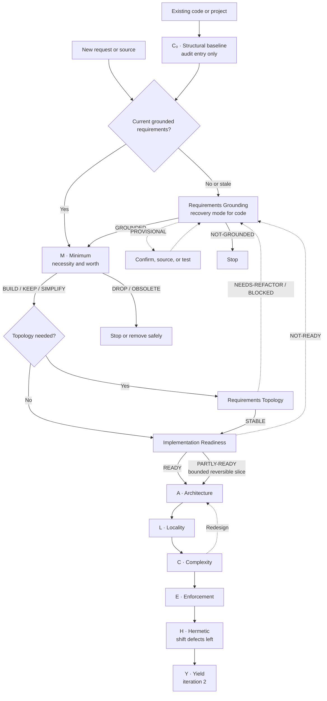

# Adaptive A.L.C.H.E.M.Y. Pipeline Design

Status: Implemented
Scope: A.L.C.H.E.M.Y. orchestration
Mode: Design
Decision: Proceed with the adaptive A.L.C.H.E.M.Y. pipeline
Blocking stage: None
Verification: `npm run validate`; package dry-run; mirror and pipeline-order checks

## Purpose

Integrate `requirements-grounding`, `requirements-topology`, and
`implementation-readiness` into A.L.C.H.E.M.Y. without changing the acronym,
weakening the existing gates, or forcing every request through a longer linear
pipeline.

The requirements skills form a conditional **Requirements Qualification
Phase** that spans the Minimum gate and precedes architectural design:

1. `requirements-grounding` establishes whether the problem, actors, scope,
   sources, and evidence are trustworthy.
2. A.L.C.H.E.M.Y. **M — Minimum** decides whether grounded functionality is
   worth its complexity cost.
3. `requirements-topology` structures surviving requirements into an atomic,
   typed dependency graph when their relationships are non-trivial.
4. `implementation-readiness` determines whether the resulting requirement
   graph is ready to enter architecture and identifies the smallest coherent
   delivery slice.

These skills qualify work entering A.L.C.H.E.M.Y.; they do not become new
letters in the acronym.

## Pipeline



Solid edges are the primary acyclic execution path. Dashed edges are explicit
rework loops and must carry the failed decision record back to the named gate.

## Entry Paths

### New capability or design

The complete path for non-trivial work is:

```text
Requirements Grounding
→ M — Minimum
→ Requirements Topology
→ Implementation Readiness
→ A — Architecture
→ L — Locality
→ C — Complexity
→ E — Enforcement
→ H — Hermetic
→ Y — Yield
```

Topology is conditional. A single bounded requirement with no meaningful
dependency relationships may move directly from M to implementation readiness.
Y remains deferred to iteration 2 unless the request concerns an existing
bottleneck.

### Existing code or project

An audit begins with a read-only structural baseline before inferring intent:

```text
C₀ — current structural baseline
→ Requirements Grounding in recovery mode, when intent is missing or stale
→ M — retrospective necessity decision
→ Requirements Topology and Implementation Readiness, when remediation continues
→ remaining A.L.C.H.E.M.Y. gates as needed
```

`C₀` is not another permanent gate or acronym letter. It is the existing
retrospective complexity scan used to expose hotspots and bound recovery work.
Implementation is evidence, not intent: code-derived requirements remain
provisional until supported by an authoritative artifact or independent
confirmation.

## Routing Rules

- `$alchemy <subject>` selects the smallest useful path and resumes from the
  latest trustworthy decision artifact.
- `$alchemy audit <subject>` starts with `C₀`; it enters requirements recovery
  only when current intent is absent, stale, contradictory, or disputed.
- Explicit gate aliases such as `$alchemy M`, `$alchemy C`, or `$alchemy E`
  remain focused. They do not silently execute the full Requirements
  Qualification Phase.
- A focused gate reports missing prerequisites in its decision record rather
  than invoking them without request authority.
- Full traversal is reserved for non-trivial work, cross-boundary change, or an
  explicit request for `full`, `all`, `audit`, `walk the gates`, or `complete
  alchemy`.
- Re-entry starts at the earliest failed decision, not at the beginning of the
  pipeline.

## Decision Hand-offs

| Stage | Passing decisions | Non-passing decisions | Hand-off artifact |
|:--|:--|:--|:--|
| Requirements Grounding | `GROUNDED` | `PROVISIONAL`, `NOT-GROUNDED` | Grounded requirement set, evidence map, assumptions, confirmation queue |
| M — Minimum | `BUILD`, `KEEP`, `SIMPLIFY` | `DEFER`, `DROP`, `OBSOLETE` | Functionality/complexity decision per candidate |
| Requirements Topology | `STABLE` | `NEEDS-REFACTOR`, `BLOCKED` | Atomic typed graph, stable IDs, dependencies, conflicts, dependency order |
| Implementation Readiness | `READY`, bounded `PARTLY-READY` | `NOT-READY` | Smallest coherent slice, verification obligations, unresolved blockers |
| A through H | Gate-specific pass | Redesign, reject, or defer | Architecture, placement, complexity, enforcement, and shift-left records |
| Y — Yield | Improvement decision | Defer until a measured constraint exists | Constraint and value-stream analysis |

`PARTLY-READY` may enter Architecture only as an explicitly bounded,
reversible slice whose unresolved requirements cannot change the slice's
meaning or invalidate its verification.

## Invariants

1. Grounding validates evidence and meaning; M owns the build, keep, simplify,
   defer, drop, or obsolete decision.
2. Requirements Topology models requirement relationships;
   Geometric Architecture places implementation components. Neither substitutes
   for the other.
3. Implementation Readiness prepares a coherent build slice without inventing
   missing requirement meaning.
4. A failed requirements decision cannot be bypassed by advancing to
   Architecture.
5. Focused aliases preserve current A.L.C.H.E.M.Y. command behavior.
6. Enforcement follows design decisions; Yield follows a stable baseline.
7. Every skipped stage has an explicit rationale in the orchestration record.

## Complexity Assessment

A naive always-on ten-stage conveyor adds three component kinds, three
dependency edges to every full route, and three levels of mandatory chain depth
without reducing the number of existing A.L.C.H.E.M.Y. modules:

| Measure | Naive always-on pipeline | Adaptive A.L.C.H.E.M.Y. pipeline |
|:--|:--|:--|
| Component-kinds Δ | `+3` | `+3` capabilities, invoked conditionally |
| Dependency-edges Δ | `+3` on every full route | Added only where evidence, topology, or readiness is unresolved |
| Max-chain-depth Δ | `+3` | Between `0` and `+3`, based on the subject |
| Module-count Δ | `0` | `0` |
| Cycle pass | Pass | Pass on solid path; dashed rework loops are controlled |

The adaptive pipeline invokes the Requirements Qualification Phase only when
the work's risk or dependency structure justifies the extra reasoning cost. It
preserves the shortest useful route for local and already-grounded decisions.

## Acceptance Criteria

The design is ready to implement when the orchestrator can satisfy all of the
following:

- Route a new, ungrounded request through grounding before M.
- Route an already-grounded request directly to M.
- Skip topology with a recorded rationale for one bounded independent
  requirement.
- Prevent `NOT-GROUNDED`, `BLOCKED`, and `NOT-READY` work from entering A.
- Admit `PARTLY-READY` only as a bounded reversible slice.
- Begin an existing-project audit at `C₀` and use recovery mode conditionally.
- Preserve focused gate and DevOps-triad aliases.
- Emit one combined decision trail with evidence, skipped-stage rationales,
  the first blocking decision, and the next action.
- Keep the solid execution path acyclic and make every rework edge explicit.

## Non-goals

- Renaming A.L.C.H.E.M.Y. or assigning new letters to requirements skills.
- Running every skill for every request.
- Treating existing implementation behavior as authoritative product intent.
- Replacing architecture or implementation decisions with requirements
  analysis.
- Changing any skill as part of this design document.
