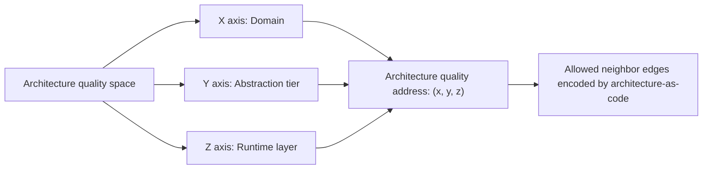
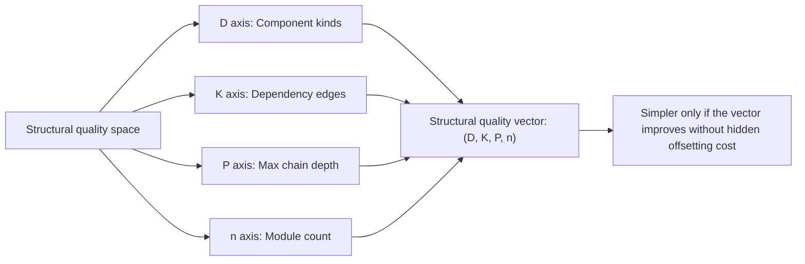
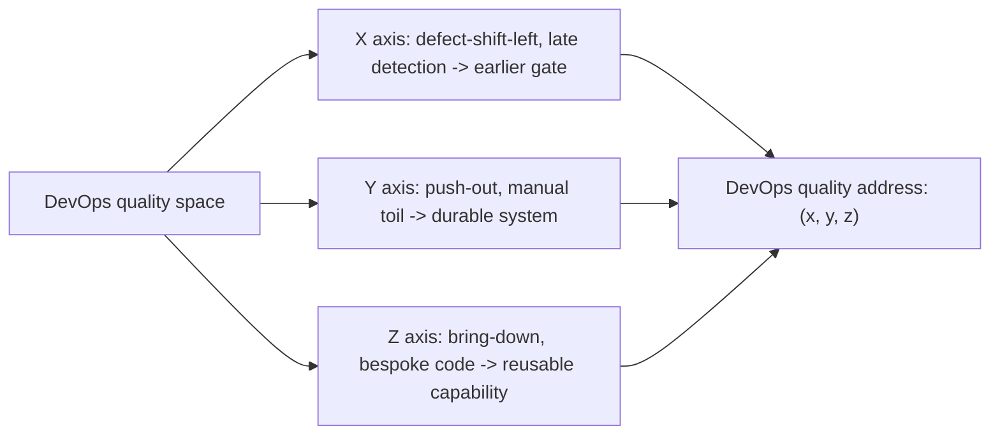

# /ALCHEMY $ALCHEMY

**THE AI ARCHITECT** By [Patrick Savalle](https://github.com/patricksavalle)


    Open-source, platform-agnostic, drop-in for any project and any compatible
    agent that you activate with /alchemy (Claude) or $alchemy (Codex).

Most agent skills teach an AI *how* to do specific tasks — write tests,
scaffold boilerplate, format code. L-GEVITY skills do something different.
They teach an agent how to *think* about software at a structural level:
the voice that asks whether a feature earns its complexity, whether a
pipeline is truly idempotent, whether a structure can be simpler before
it's optimized.

---

## The command: alchemy

After install, use one command as the entrypoint:

```text
/alchemy <subject>   # Claude Code
$alchemy <subject>   # Codex
```

Examples:

```text
/alchemy this auth refactor
/alchemy M this feature
/alchemy E module boundaries
/alchemy H the deploy pipeline
/alchemy out repeated release handoffs
/alchemy down our bespoke retry wrapper
/alchemy ?
```

Codex uses the same grammar with `$alchemy` instead of `/alchemy`.

Default output is intentionally small:

```text
Route:    <M | A | L | C | E | H | Y | left | out | down>
Verdict:  Proceed | Redesign | Drop | Defer
Reason:   <one or two lines>
Next:     <one concrete action>
```

Use `/alchemy <subject>` when you want the agent to pick the right gates. Use
`/alchemy <letter> <subject>` when you already know the question you want
answered. Use the DevOps improvement triad, `/alchemy left|out|down`, when the
work is about earlier defect detection, operational toil, or reusable
capability. Focused commands stay focused; ask for `full`, `all`, or `audit`
when you want the complete pass.

## The seven gates of A.L.C.H.E.M.Y.

A.L.C.H.E.M.Y. is the name of the gate discipline. The letters are memorable;
the execution order is different: **M → A → L → C → E → H → Y**. Necessity runs
first, optimization runs last, because enforcing or optimizing the wrong design
locks in waste.

| Command | Gate | The question it forces | Skill |
|---|---|---|---|
| `/alchemy M` | **Minimum** | *Does this functionality address a real problem worth its cost?* | [`functionality-complexity-tradeoff`](./.claude/skills/functionality-complexity-tradeoff/SKILL.md) |
| `/alchemy A` | **Architecture** | *Is the design minimal, modular, named for its purpose?* | [`architecture-guidelines`](./.claude/skills/architecture-guidelines/SKILL.md) |
| `/alchemy L` | **Locality** | *Where does this component live? Which neighbors may it import?* | [`geometric-architecture`](./.claude/skills/geometric-architecture/SKILL.md) |
| `/alchemy C` | **Complexity** | *Does this restructuring actually simplify, on every axis?* | [`structural-simplification`](./.claude/skills/structural-simplification/SKILL.md) |
| `/alchemy E` | **Enforcement** | *Are the architectural rules encoded as lint, not prose?* | [`architecture-as-code`](./.claude/skills/architecture-as-code/SKILL.md) |
| `/alchemy H` | **Hermetic** | *Is each defect sealed at the earliest stage that can catch it?* | [`defect-shift-left`](./.claude/skills/defect-shift-left/SKILL.md) |
| `/alchemy Y` | **Yield** | *What is the constraint that actually limits flow?* | [`system-optimization`](./.claude/skills/system-optimization/SKILL.md) |

The [`alchemy`](./.claude/skills/alchemy/SKILL.md) skill is the orchestrator. It
routes to the sibling skills, reads the selected sibling `SKILL.md`, and returns
the smallest useful verdict. **H = Hermetic** in the literal sense (sealed
against leakage at every stage) and in the alchemical-tradition sense (the
Hermetic art).

For non-trivial work, Alchemy now uses an adaptive **Requirements Qualification
Phase** around M: `requirements-grounding` when meaning or evidence is missing,
optional `requirements-topology` when relationships are non-trivial, and
`implementation-readiness` before A. Focused aliases stay focused, and every
skipped stage records a rationale. `NOT-GROUNDED`, `BLOCKED`, and `NOT-READY`
work cannot enter Architecture; `PARTLY-READY` work may enter only as a bounded,
reversible slice.

The implemented routing design and acceptance criteria are recorded in
[ALCHEMY-PIPELINE-DESIGN.md](./ALCHEMY-PIPELINE-DESIGN.md).

## DevOps improvement triad

The core gates answer architecture and refactor questions. The DevOps
improvement triad moves recurring operational problems into better places:

| Command | Move | Use when | Skill |
|---|---|---|---|
| `/alchemy left` | Shift left | Defects are detected too late. | [`defect-shift-left`](./.claude/skills/defect-shift-left/SKILL.md) |
| `/alchemy out` | Push out | Recurring toil lives in human memory, tickets, or local practice. | [`push-out`](./.claude/skills/push-out/SKILL.md) |
| `/alchemy down` | Bring down | Bespoke or duplicated code should become reusable capability. | [`bring-down`](./.claude/skills/bring-down/SKILL.md) |

`/alchemy Y` may recommend `out` or `down` when the bottleneck is toil or
bespoke implementation, but the triad does not run as part of the seven-gate
sequence unless you ask for it.

The result: an agent that doesn't just *write* your code, but argues with you
about whether the code should exist, where it belongs, how complex it makes the
system, and which quality space it should improve.

---

## Example output


---

## Three quality spaces

### Geometric architecture

Architecture quality is a coordinate problem: a component should sit in the
right domain, at the right abstraction tier, in the right runtime layer.
`geometric-architecture` assigns that `(x, y, z)` address; `architecture-as-code`
turns the allowed neighboring edges into enforceable rules.



### Structural simplification

Structural quality is a vector problem: a change is simpler only if it improves
the shape of the system across component kinds, dependency edges, chain depth,
and module count. `structural-simplification` makes that claim measurable.



### DevOps improvement triad

DevOps quality is also a coordinate problem. The DevOps improvement triad moves
work along three axes: detect defects earlier, push recurring toil outward, and
bring bespoke implementation down into reusable capability.



---

## Compatible with the open Agent Skills standard

These skills follow the [Agent Skills standard](https://agentskills.io/) —
a lightweight open format originally developed by Anthropic, now adopted
across the agent ecosystem. They work natively with [Claude Code](https://claude.ai/claude-code),
[Google Antigravity](https://antigravity.google), [OpenCode](https://opencode.ai),
and [any other tool](https://agentskills.io/clients) that loads `SKILL.md`
files (Cursor, Codex CLI, Gemini CLI, Kimi CLI, …).

---

## Quick Start

You are already using an AI coding agent. Let it do the install. Open
your project in Claude Code, OpenCode, Antigravity, Cursor, Codex CLI,
Gemini CLI, Grok CLI, Kimi CLI, or any other agent that can run shell
commands and write files, and paste:

> **Install the L-GEVITY A.L.C.H.E.M.Y. skill library into this project
> from `https://github.com/l-gevity/l-gevity-skills`. Use the install
> script in `.install/` that matches the agent you are (e.g.
> `install-claude.sh` / `.ps1` for Claude Code, `install-codex.*` for
> Codex CLI, `install-gemini.*` for Gemini CLI, `install-grok.*` for
> Grok CLI; pick the OS variant for this machine). The script places
> skills under `.claude/skills/` and the strategic-directives memory
> file (`CLAUDE.md` / `AGENTS.md` / `GEMINI.md` / `GROK.md`) in the
> project root. If a memory file already exists, the upstream version
> is written beside it as `<name>.l-gevity` for me to merge manually.
> Re-running this prompt later refreshes upstream skills without
> touching anything in `.claude/skills/` that I added myself.**

The agent will fetch, inspect, and run the appropriate script — no need
to remember `curl` flags or PowerShell syntax. Re-paste the prompt later
to refresh upstream.

<details>
<summary><b>Prefer to run it yourself?</b> One-liners (no <code>git</code> required)</summary>

**Linux / macOS:**

```bash
curl -fsSL https://raw.githubusercontent.com/l-gevity/l-gevity-skills/main/.install/install-claude.sh | bash
```

**Windows (PowerShell):**

```powershell
iwr -useb https://raw.githubusercontent.com/l-gevity/l-gevity-skills/main/.install/install-claude.ps1 | iex
```

Swap `install-claude` for `install-codex` / `install-gemini` /
`install-grok` to target another agent's memory file. Re-run any time
to refresh upstream.

</details>

<details>
<summary><b>Advanced</b> — subrepo or vendored copy</summary>

**Subrepo (track upstream via git).**

```bash
git submodule add https://github.com/l-gevity/l-gevity-skills .claude/skills-src
ln -s skills-src/.claude/skills .claude/skills
cp .claude/skills-src/CLAUDE.md ./CLAUDE.md
```

Update later: `git submodule update --remote .claude/skills-src`.

**Vendored copy (frozen snapshot, edit freely).**

```bash
git clone --depth 1 https://github.com/l-gevity/l-gevity-skills .tmp-skills
rm -rf .claude/skills && mkdir -p .claude && mv .tmp-skills/.claude/skills .claude/skills && mv -f .tmp-skills/CLAUDE.md . && rm -rf .tmp-skills
```

Re-run to update (overwrites `.claude/skills/` and `CLAUDE.md` — back
up first if customized).

</details>

After install:

```
your-project/
├── CLAUDE.md                    ← strategic directives
└── .claude/skills/
    ├── alchemy/
    ├── architecture-guidelines/
    ├── structural-simplification/
    └── ...
```

`CLAUDE.md` already references skills by `./.claude/skills/<name>/` — no edits
needed unless you move things. Start with `/alchemy ?` in Claude Code or
`$alchemy ?` in Codex.

---

## The full skill index

Eighteen skills total: seven gate skills, one orchestrator, two stack
implementations of **E**, one pipeline-reliability skill that extends **H**,
two additional DevOps improvement-axis skills, four requirements-discipline
skills, and one meta-layer. Every skill ships
as a `SKILL.md` (operational reference) with a matching `READ-<skill>.md` primer in
[`./.documentation/`](./.documentation/).

### Prime directives

| | Use it to |
| :----- | :-------- |
| [CLAUDE.md](./CLAUDE.md) | Strategic attitude an agent brings to *any* task in *any* codebase using this library — when to ask, when to surface conflicts, how to fail loud, how to walk the gates in order. |

### The seven gates of A.L.C.H.E.M.Y.

| Skill | Letter | Primer | Use it to |
| :---- | :----- | :----- | :-------- |
| [architecture-guidelines](./.claude/skills/architecture-guidelines/SKILL.md) | **A** | [READ](./.documentation/READ-architecture-guidelines.md) | Test every module decision — minimalism, modularity, functional core, resilience, naming, concurrency — against a first-principles checklist before code is written. |
| [geometric-architecture](./.claude/skills/geometric-architecture/SKILL.md) | **L** | [READ](./.documentation/READ-geometric-architecture.md) | Place a component on the Domain / Tier / Layer grid, and audit existing graphs for layer-skip violations, cycles, god components, and cross-domain coupling. |
| [structural-simplification](./.claude/skills/structural-simplification/SKILL.md) | **C** | [READ](./.documentation/READ-structural-simplification.md) | Compare two designs along four independent axes — component-kinds, dependency-edges, max-chain-depth, module-count — so "this is simpler" becomes a measurable claim instead of a feeling. |
| [defect-shift-left](./.claude/skills/defect-shift-left/SKILL.md) | **H** | [READ](./.documentation/READ-defect-shift-left.md) | For every error path, name the earliest stage (type system, lint, pre-commit, CI gate, …) that can catch it — and move the check there. |
| [architecture-as-code](./.claude/skills/architecture-as-code/SKILL.md) | **E** | [READ](./.documentation/READ-architecture-as-code.md) | Stack-agnostic pattern: per-module config files merged into a single ruleset, lint-enforced. Schema, rule-placement discipline, assembler pipeline, and anti-patterns. |
| [functionality-complexity-tradeoff](./.claude/skills/functionality-complexity-tradeoff/SKILL.md) | **M** | [READ](./.documentation/READ-functionality-complexity-tradeoff.md) | Decide whether to BUILD / DEFER / DROP a proposed feature, or KEEP / SIMPLIFY / DELETE / OBSOLETE existing code — via a necessity gate followed by a worth ledger. |
| [system-optimization](./.claude/skills/system-optimization/SKILL.md) | **Y** | [READ](./.documentation/READ-system-optimization.md) | Run optimization in the right order — question, delete, simplify, speed up, automate — instead of caching or parallelizing work that should have been deleted. |

### Requirements discipline

| Skill | Discipline | Primer | Use it to |
| :---- | :--------- | :----- | :-------- |
| [requirements-grounding](./.claude/skills/requirements-grounding/SKILL.md) | Grounding | [READ](./.documentation/READ-requirements-grounding.md) | Ground proposed requirements in an actor-bound problem, or recover provisional candidates from code and project evidence without mistaking implementation for intent. |
| [requirements-topology](./.claude/skills/requirements-topology/SKILL.md) | Topology | [READ](./.documentation/READ-requirements-topology.md) | Structure validated requirements as a typed dependency graph; detect cycles, orphans, duplicates, conflicts, stale references, and missing verification. |
| [implementation-readiness](./.claude/skills/implementation-readiness/SKILL.md) | Readiness | [READ](./.documentation/READ-implementation-readiness.md) | Decide what is ready, partly ready, or blocked, then derive the smallest traceable build-preparation package without inventing requirement meaning. |
| [requirements-traceability](./.claude/skills/requirements-traceability/SKILL.md) | Traceability | [READ](./.documentation/READ-requirements-traceability.md) | Maintain bidirectional links from canonical IDs to implementation and executed evidence while keeping implemented and verified states distinct. |

### Orchestration and implementations

| Skill | Role | Primer | Use it to |
| :---- | :--- | :----- | :-------- |
| [alchemy](./.claude/skills/alchemy/SKILL.md) | Orchestrator | [READ](./.documentation/READ-alchemy.md) | Qualify requirements conditionally, then route `/alchemy` commands through the seven gates and DevOps improvement triad while keeping focused commands focused. |
| [architecture-as-code-javascript](./.claude/skills/architecture-as-code-javascript/SKILL.md) | **E** impl | [READ](./.documentation/READ-architecture-as-code-javascript.md) | JavaScript / TypeScript implementation — `eslint.architecture.mjs` files merged into one ESLint flat-config via `eslint-plugin-boundaries`. |
| [architecture-as-code-python](./.claude/skills/architecture-as-code-python/SKILL.md) | **E** impl | [READ](./.documentation/READ-architecture-as-code-python.md) | Python implementation — per-package `architecture.toml` files merged into an `import-linter` config and enforced via `lint-imports`. |
| [ci-cd-reliability-architecture](./.claude/skills/ci-cd-reliability-architecture/SKILL.md) | Extends **H** | [READ](./.documentation/READ-ci-cd-reliability-architecture.md) | Design or audit reliable CI/CD, evidence-gated release, production promotion, rollback, and operational handoff. |
| [push-out](./.claude/skills/push-out/SKILL.md) | Improvement | [READ](./.documentation/READ-push-out.md) | Move recurring DevOps work out of individual memory, manual execution, ticket queues, and local practice into standards, platforms, self-service controls, and feedback loops. |
| [bring-down](./.claude/skills/bring-down/SKILL.md) | Improvement | [READ](./.documentation/READ-bring-down.md) | Move bespoke, duplicated, or over-local code down into approved libraries, external standards, platform products, or managed services. |
| [continuous-improvement](./.claude/skills/continuous-improvement/SKILL.md) | Meta-layer | [READ](./.documentation/READ-continuous-improvement.md) | Decide whether a correction becomes a test, a linter rule, or a SKILL edit — and which SKILL owns it — without letting the library bloat. |

---

## Use cases at a glance

- **Before adding a feature.** Run `/alchemy M this feature` — weighs value against
  complexity cost, proposes a smaller version, or pushes back entirely.
- **Reviewing a pull request.** Run `/alchemy audit this PR` — checks the diff
  against first-principles and against the Domain / Tier / Layer grid.
- **Cleaning up a tangled module.** Run `/alchemy C this module` — measures complexity
  on four axes; surfaces hot-spots before any optimization work begins.
- **Hardening a CI/CD pipeline.** Run `/alchemy H the deploy pipeline`
  — sealing defects at the earliest stage and the pipeline against
  non-idempotent steps, mutable artifacts, hidden state, and unverified promotion.
- **Pushing out operational toil.** Run `/alchemy out release handoffs` — locates where
  recurring work lives, then moves it into standards, platforms, self-service
  controls, or feedback loops.
- **Bringing down bespoke code.** Run `/alchemy down retry wrapper` — moves repeated
  one-off implementations into approved libraries, external standards, platform
  products, or managed services when maintenance-burden and owner-change
  evidence justify it.
- **Speeding up a slow system.** Run `/alchemy Y this slow system` — finds the real
  constraint instead of optimizing whatever is most visible.
- **Deciding what to delete.** Run `/alchemy M this old code` — same gate,
  same rigor, applied to existing code.
- **Grounding a requirement set.** Use `requirements-grounding` to separate the
  real problem, scope, sources, evidence, assumptions, and atomic requirement
  candidates before a backlog hardens around an assumed solution—or recover
  provisional candidates from an undocumented or drifted implementation.
- **Finding requirement dependencies.** Use `requirements-topology` to expose
  prerequisites, constraints, cycles, duplicates, conflicts, and missing
  verification, then derive a trustworthy dependency order.
- **Preparing implementation.** Use `implementation-readiness` to distinguish
  ready, partly ready, and blocked work and derive the smallest coherent slice,
  contracts, ADR questions, and test references.
- **Tracing implementation and proof.** Use `requirements-traceability` after
  readiness to connect canonical IDs to implementation, passing test or
  operational evidence, and reverse-trace gaps without treating anchors as
  verification.
- **Improving the skills themselves.** When a skill gives bad advice,
  `continuous-improvement` runs root-cause analysis on the skill's text
  and proposes an edit, so the same mistake does not recur.

---

## Project-to-library learning loop

Consumer projects are evidence sources, not owners of generic method. Promote a
reusable correction into this repository first, keep `.agents` and `.claude`
mirrors plus primers/validation aligned, publish the reviewed revision, and only
then repin the consumer. Project names, paths, schemas, taxonomies, commands,
roles, and domain policy stay in a project profile or local skill.

See [CONTRIBUTING.md](./CONTRIBUTING.md) for the complete promotion and genericity
contract.

## What this pack is *not*

Scoped deliberately. These skills teach an agent how to *think* about
architecture, requirements, and pipeline reliability. They do **not** cover coding
standards (language conventions, naming), testing strategy (what to test,
when to mock), security baseline (input sanitization, OWASP), PR / commit
hygiene, product release planning/versioning, ongoing production operations,
UI / visual design, or your domain-specific
knowledge. The requirements skills supply a method, not domain facts. Layer those
on top with your own SKILLs.

---

## License

[MIT](./LICENSE)
