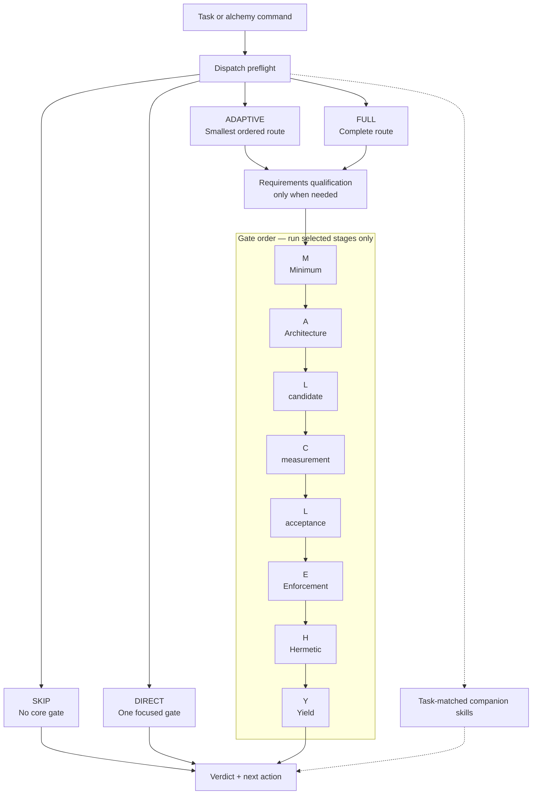
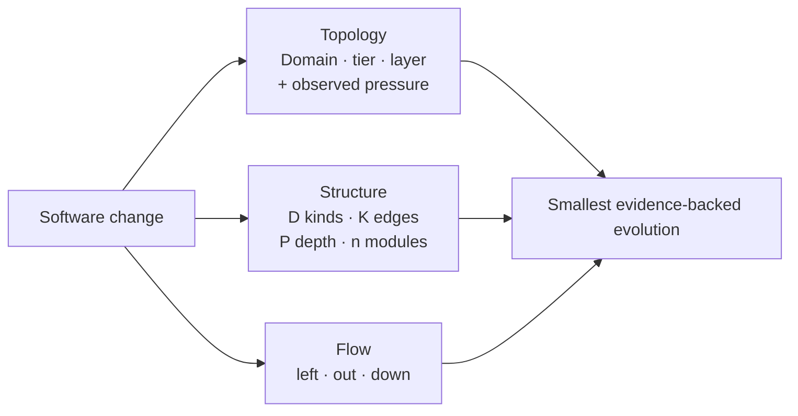
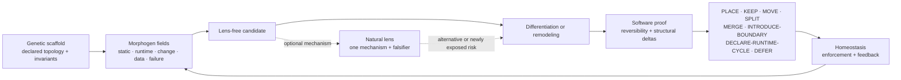

# L-GEVITY Skills


**Architecture judgment for AI coding agents.**

L-GEVITY is an open-source [Agent Skills](https://agentskills.io/) library for
requirements, architecture, testing, CI/CD, and continuous improvement. It
helps coding agents decide what should exist, where it belongs, and how to keep
it simple—not just generate more code.

## 1. Start here

### Install

Prompt your coding agent:

> Install [l-gevity/l-gevity-skills](https://github.com/l-gevity/l-gevity-skills) into this project.

The agent can inspect the repository, choose its installer, and verify the
result. Use the same prompt later to update.

### Use

Start with natural language:

```text
do some alchemy on this refactor
```

Or direct the router:

```text
/alchemy this auth refactor       # Claude Code
$alchemy this auth refactor       # Codex
/alchemy M should we build this?  # one focused gate
/alchemy audit this PR            # expanded analysis
/alchemy ?                        # help
```

Alchemy runs a lightweight preflight, skips routine work, and loads only the
skills the task needs.

---

## 2. Visual model

### A.L.C.H.E.M.Y. pipeline

The preflight keeps the default path cheap. A focused request runs one gate;
adaptive work runs the smallest ordered subset; only explicit full language
walks the complete route.



### Three quality spaces

Alchemy evaluates a change from three complementary directions instead of
collapsing every concern into one score.



### Living topology

Morphogenetic architecture transfers mechanisms from living systems—not their
silhouettes. A biological lens may propose a candidate or expose a risk;
software evidence still decides.



---

## 3. Reference

### The gates

The mnemonic is **A.L.C.H.E.M.Y.**; the execution order is
**M → A → L → C → E → H → Y** so value is tested before design is enforced or
optimized.

| Gate | Question |
|---|---|
| **M — Minimum** | Is the functionality worth its complexity? |
| **A — Architecture** | Is the design minimal, modular, and purposeful? |
| **L — Locality** | Is each component in the right boundary? |
| **C — Complexity** | Does the change measurably simplify the system? |
| **E — Enforcement** | Can architectural rules be encoded as checks? |
| **H — Hermetic** | Is each defect caught at the earliest capable stage? |
| **Y — Yield** | What constraint actually limits flow? |

The DevOps improvement moves complement the gates:

| Command | Move |
|---|---|
| `/alchemy left` | Detect defects earlier. |
| `/alchemy out` | Move recurring toil into durable systems. |
| `/alchemy down` | Replace bespoke code with reusable capability. |

<details>
<summary><strong>How routing works</strong></summary>

The [`alchemy`](./.agents/skills/alchemy/SKILL.md) skill classifies work before
loading deeper instructions:

- `SKIP` — routine local work needs no structural analysis.
- `DIRECT` — one concern maps to one skill.
- `ADAPTIVE` — non-trivial work gets the smallest ordered route.
- `FULL` — an explicit full audit traverses the complete pipeline.

Its compact result reports the dispatch, route, companions, verdict, reason,
and next action. Focused commands remain focused; use `full`, `all`, or `audit`
when you want a broader trail.

```text
Dispatch:   SKIP | DIRECT | ADAPTIVE | FULL
Core route: None | selected gates
Companions: None | task-matched skills
Verdict:    Proceed | Redesign | Drop | Defer
Next:       one concrete action
```

See [the pipeline design](./ALCHEMY-PIPELINE-DESIGN.md) for routing rules,
requirements qualification, gate handshakes, and acceptance criteria.

Locality starts with a **Rapid placement/static-edge scan**. It escalates
**Rapid → Full** for **restructure · non-static evidence · broad scope · ambiguity**.
Rapid can return `PLACE`, `KEEP`, `DECLARE-RUNTIME-CYCLE`, or `DEFER`; Full can
also return `MOVE`, `SPLIT`, `MERGE`, or `INTRODUCE-BOUNDARY`.

Topology changes use one bounded **L candidate → C measurement → L acceptance**
handshake. L re-enters once; **Gate E cannot run before** that acceptance.

</details>

<details>
<summary><strong>What is included</strong></summary>

The library contains 19 composable skills. Each has an operational `SKILL.md`
and a human-oriented primer.

| Skill | Primer |
|---|---|
| [`alchemy`](./.claude/skills/alchemy/SKILL.md) | [Read](./.documentation/READ-alchemy.md) |
| [`functionality-complexity-tradeoff`](./.claude/skills/functionality-complexity-tradeoff/SKILL.md) | [Read](./.documentation/READ-functionality-complexity-tradeoff.md) |
| [`architecture-guidelines`](./.claude/skills/architecture-guidelines/SKILL.md) | [Read](./.documentation/READ-architecture-guidelines.md) |
| [`morphogenetic-architecture`](./.claude/skills/morphogenetic-architecture/SKILL.md) | [Read](./.documentation/READ-morphogenetic-architecture.md) |
| [`structural-simplification`](./.claude/skills/structural-simplification/SKILL.md) | [Read](./.documentation/READ-structural-simplification.md) |
| [`architecture-as-code`](./.claude/skills/architecture-as-code/SKILL.md) | [Read](./.documentation/READ-architecture-as-code.md) |
| [`architecture-as-code-javascript`](./.claude/skills/architecture-as-code-javascript/SKILL.md) | [Read](./.documentation/READ-architecture-as-code-javascript.md) |
| [`architecture-as-code-python`](./.claude/skills/architecture-as-code-python/SKILL.md) | [Read](./.documentation/READ-architecture-as-code-python.md) |
| [`defect-shift-left`](./.claude/skills/defect-shift-left/SKILL.md) | [Read](./.documentation/READ-defect-shift-left.md) |
| [`ci-cd-reliability-architecture`](./.claude/skills/ci-cd-reliability-architecture/SKILL.md) | [Read](./.documentation/READ-ci-cd-reliability-architecture.md) |
| [`system-optimization`](./.claude/skills/system-optimization/SKILL.md) | [Read](./.documentation/READ-system-optimization.md) |
| [`push-out`](./.claude/skills/push-out/SKILL.md) | [Read](./.documentation/READ-push-out.md) |
| [`bring-down`](./.claude/skills/bring-down/SKILL.md) | [Read](./.documentation/READ-bring-down.md) |
| [`requirements-grounding`](./.claude/skills/requirements-grounding/SKILL.md) | [Read](./.documentation/READ-requirements-grounding.md) |
| [`requirements-topology`](./.claude/skills/requirements-topology/SKILL.md) | [Read](./.documentation/READ-requirements-topology.md) |
| [`implementation-readiness`](./.claude/skills/implementation-readiness/SKILL.md) | [Read](./.documentation/READ-implementation-readiness.md) |
| [`requirements-traceability`](./.claude/skills/requirements-traceability/SKILL.md) | [Read](./.documentation/READ-requirements-traceability.md) |
| [`test-strategy`](./.claude/skills/test-strategy/SKILL.md) | [Read](./.documentation/READ-test-strategy.md) |
| [`continuous-improvement`](./.claude/skills/continuous-improvement/SKILL.md) | [Read](./.documentation/READ-continuous-improvement.md) |

Grounding keeps **decision-relevant outcome hypotheses** separate from
acceptance criteria, avoiding **confusing impact with completion**. Traceability
maintains **versioned outcome measurements and freshness**. **Revisiting value after release**
routes current evidence back to the Minimum gate for a bounded worth decision.

</details>

<details>
<summary><strong>Installation details</strong></summary>

Installers are provided for Claude Code, Codex, Gemini CLI, and Grok CLI on
Windows, Linux, and macOS. They install the shared skills under
`.claude/skills/`, add the agent's root instruction file, and record provenance
in `l-gevity-skills.lock.json`.

An existing root instruction file is preserved; the L-GEVITY version is written
beside it with a `.l-gevity` suffix for manual merging. Locally added skills are
not removed during updates. Set `L_GEVITY_SKILLS_REF` to pin a branch, tag, or
commit.

[Inspect the installer scripts](./.install/).

</details>

<details>
<summary><strong>Scope</strong></summary>

These skills cover structural reasoning: requirements, architecture,
verification strategy, delivery reliability, and improvement. They do not
replace project-specific domain knowledge, coding conventions, security rules,
framework recipes, or release policy. Layer those on with your own skills and
instructions.

</details>

## Contributing

See [CONTRIBUTING.md](./CONTRIBUTING.md) for the genericity and promotion
contract. Licensed under [MIT](./LICENSE).
