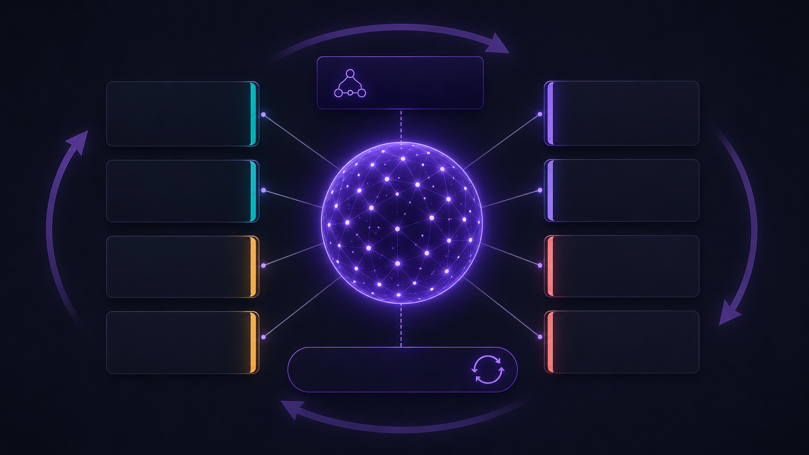

# L-GEVITY Skills — AI A.L.C.H.E.M.Y.
**The architect for your AI coding agent.**

[](overview.png)

Most agent skills teach an AI *how* to do specific tasks — write tests,
scaffold boilerplate, format code. L-GEVITY skills do something different.
They teach an agent how to *think* about software at a structural level:
the voice that asks whether a feature earns its complexity, whether a
pipeline is truly idempotent, whether a structure can be simpler before
it's optimized.

Open-source, platform-agnostic, drop-in for any project and any compatible
agent.

---

## The seven gates of A.L.C.H.E.M.Y.

A.L.C.H.E.M.Y. is the seven-gate discipline at the core of this skillset.
Each letter names a gate; each gate is a separate SKILL the agent invokes
when its question comes up.

| | Letter | Gate | The question it forces | Skill |
|---|---|---|---|---|
| **A** | **Architecture** | First principles | *Is the design minimal, modular, named for its purpose?* | [`architecture-guidelines`](./.claude/skills/architecture-guidelines/SKILL.md) |
| **L** | **Locality** | Geometric placement | *Where does this component live? Which neighbors may it import?* | [`geometric-architecture`](./.claude/skills/geometric-architecture/SKILL.md) |
| **C** | **Complexity** | Structural measurement | *Does this restructuring actually simplify, on every axis?* | [`structural-simplification`](./.claude/skills/structural-simplification/SKILL.md) |
| **H** | **Hermetic** | Shift-left sealing | *Is each defect sealed at the earliest stage that can catch it?* | [`defect-shift-left`](./.claude/skills/defect-shift-left/SKILL.md) |
| **E** | **Enforcement** | Architecture as code | *Are the architectural rules encoded as lint, not prose?* | [`architecture-as-code`](./.claude/skills/architecture-as-code/SKILL.md) |
| **M** | **Minimum** | Necessity & worth | *Does this functionality address a real problem worth its cost?* | [`functionality-complexity-tradeoff`](./.claude/skills/functionality-complexity-tradeoff/SKILL.md) |
| **Y** | **Yield** | System optimization | *What is the constraint that actually limits flow?* | [`system-optimization`](./.claude/skills/system-optimization/SKILL.md) |

> **Mnemonic vs. sequence.** A.L.C.H.E.M.Y. is the *name* of the discipline.
> The *execution order* is **M → A → L → C → E → H → Y** — necessity before
> structure, optimization last, because enforcing what shouldn't exist
> freezes over-engineering in. The orchestration is owned by
> [`design-and-refactor`](./.claude/skills/design-and-refactor/SKILL.md).
> **H = Hermetic** in the literal sense (sealed against leakage at every
> stage) and in the alchemical-tradition sense (the Hermetic art) — both
> readings fit.

The result: an agent that doesn't just *write* your code, but argues with
you about whether the code should exist — and whether it should look the
way you proposed.

---

## Compatible with the open Agent Skills standard

These skills follow the [Agent Skills standard](https://agentskills.io/) —
a lightweight open format originally developed by Anthropic, now adopted
across the agent ecosystem. They work natively with [Claude Code](https://claude.ai/claude-code),
[Google Antigravity](https://antigravity.google), [OpenCode](https://opencode.ai),
and [any other tool](https://agentskills.io/clients) that loads `SKILL.md`
files (Cursor, Codex CLI, Gemini CLI, Kimi CLI, …).

---

## Quick Start

You are already using an AI coding agent. Let it do the install. Open
your project in Claude Code, OpenCode, Antigravity, Cursor, Codex CLI,
Gemini CLI, Grok CLI, Kimi CLI, or any other agent that can run shell
commands and write files, and paste:

> **Install the L-GEVITY A.L.C.H.E.M.Y. skill library into this project
> from `https://github.com/l-gevity/l-gevity-skills`. Use the install
> script in `.install/` that matches the agent you are (e.g.
> `install-claude.sh` / `.ps1` for Claude Code, `install-codex.*` for
> Codex CLI, `install-gemini.*` for Gemini CLI, `install-grok.*` for
> Grok CLI; pick the OS variant for this machine). The script places
> skills under `.claude/skills/` and the strategic-directives memory
> file (`CLAUDE.md` / `AGENTS.md` / `GEMINI.md` / `GROK.md`) in the
> project root. If a memory file already exists, the upstream version
> is written beside it as `<name>.l-gevity` for me to merge manually.
> Re-running this prompt later refreshes upstream skills without
> touching anything in `.claude/skills/` that I added myself.**

The agent will fetch, inspect, and run the appropriate script — no need
to remember `curl` flags or PowerShell syntax. Re-paste the prompt later
to refresh upstream.

<details>
<summary><b>Prefer to run it yourself?</b> One-liners (no <code>git</code> required)</summary>

**Linux / macOS:**

```bash
curl -fsSL https://raw.githubusercontent.com/l-gevity/l-gevity-skills/main/.install/install-claude.sh | bash
```

**Windows (PowerShell):**

```powershell
iwr -useb https://raw.githubusercontent.com/l-gevity/l-gevity-skills/main/.install/install-claude.ps1 | iex
```

Swap `install-claude` for `install-codex` / `install-gemini` /
`install-grok` to target another agent's memory file. Re-run any time
to refresh upstream.

</details>

<details>
<summary><b>Advanced</b> — subrepo or vendored copy</summary>

**Subrepo (track upstream via git).**

```bash
git submodule add https://github.com/l-gevity/l-gevity-skills .claude/skills-src
ln -s skills-src/.claude/skills .claude/skills
cp .claude/skills-src/CLAUDE.md ./CLAUDE.md
```

Update later: `git submodule update --remote .claude/skills-src`.

**Vendored copy (frozen snapshot, edit freely).**

```bash
git clone --depth 1 https://github.com/l-gevity/l-gevity-skills .tmp-skills
rm -rf .claude/skills && mkdir -p .claude && mv .tmp-skills/.claude/skills .claude/skills && mv -f .tmp-skills/CLAUDE.md . && rm -rf .tmp-skills
```

Re-run to update (overwrites `.claude/skills/` and `CLAUDE.md` — back
up first if customized).

</details>

After install:

```
your-project/
├── CLAUDE.md                    ← strategic directives
└── .claude/skills/
    ├── architecture-guidelines/
    ├── structural-simplification/
    └── ...
```

`CLAUDE.md` already references skills by `./.claude/skills/<name>/` — no
edits needed unless you move things.

---

## The full skill index

Twelve skills total: seven gate skills, one orchestrator, two stack
implementations of **E**, one pipeline-reliability skill that extends **H**,
and one meta-layer. Every skill ships as a `SKILL.md` (operational
reference) with a matching `READ-<skill>.md` primer in
[`./.documentation/`](./.documentation/).

### Prime directives

| | Use it to |
| :----- | :-------- |
| [CLAUDE.md](./CLAUDE.md) | Strategic attitude an agent brings to *any* task in *any* codebase using this library — when to ask, when to surface conflicts, how to fail loud, how to walk the gates in order. |

### The seven gates of A.L.C.H.E.M.Y.

| Skill | Letter | Primer | Use it to |
| :---- | :----- | :----- | :-------- |
| [architecture-guidelines](./.claude/skills/architecture-guidelines/SKILL.md) | **A** | [READ](./.documentation/READ-architecture-guidelines.md) | Test every module decision — minimalism, modularity, functional core, resilience, naming, concurrency — against a first-principles checklist before code is written. |
| [geometric-architecture](./.claude/skills/geometric-architecture/SKILL.md) | **L** | [READ](./.documentation/READ-geometric-architecture.md) | Place a component on the Domain / Tier / Layer grid, and audit existing graphs for layer-skip violations, cycles, god components, and cross-domain coupling. |
| [structural-simplification](./.claude/skills/structural-simplification/SKILL.md) | **C** | [READ](./.documentation/READ-structural-simplification.md) | Compare two designs along four independent axes — component-kinds, dependency-edges, max-chain-depth, module-count — so "this is simpler" becomes a measurable claim instead of a feeling. |
| [defect-shift-left](./.claude/skills/defect-shift-left/SKILL.md) | **H** | [READ](./.documentation/READ-defect-shift-left.md) | For every error path, name the earliest stage (type system, lint, pre-commit, CI gate, …) that can catch it — and move the check there. |
| [architecture-as-code](./.claude/skills/architecture-as-code/SKILL.md) | **E** | [READ](./.documentation/READ-architecture-as-code.md) | Stack-agnostic pattern: per-module config files merged into a single ruleset, lint-enforced. Schema, rule-placement discipline, assembler pipeline, and anti-patterns. |
| [functionality-complexity-tradeoff](./.claude/skills/functionality-complexity-tradeoff/SKILL.md) | **M** | [READ](./.documentation/READ-functionality-complexity-tradeoff.md) | Decide whether to BUILD / DEFER / DROP a proposed feature, or KEEP / SIMPLIFY / DELETE / OBSOLETE existing code — via a necessity gate followed by a worth ledger. |
| [system-optimization](./.claude/skills/system-optimization/SKILL.md) | **Y** | [READ](./.documentation/READ-system-optimization.md) | Run optimization in the right order — question, delete, simplify, speed up, automate — instead of caching or parallelizing work that should have been deleted. |

### Orchestration and implementations

| Skill | Role | Primer | Use it to |
| :---- | :--- | :----- | :-------- |
| [design-and-refactor](./.claude/skills/design-and-refactor/SKILL.md) | Orchestrator | [READ](./.documentation/READ-design-and-refactor.md) | Sequence the seven gates in dependency order (M → A → L → C → E → H → Y) so enforcement never precedes design and speculative generality is caught at **M**, not after a rewrite. |
| [architecture-as-code-javascript](./.claude/skills/architecture-as-code-javascript/SKILL.md) | **E** impl | [READ](./.documentation/READ-architecture-as-code-javascript.md) | JavaScript / TypeScript implementation — `eslint.architecture.mjs` files merged into one ESLint flat-config via `eslint-plugin-boundaries`. |
| [architecture-as-code-python](./.claude/skills/architecture-as-code-python/SKILL.md) | **E** impl | [READ](./.documentation/READ-architecture-as-code-python.md) | Python implementation — per-package `architecture.toml` files merged into an `import-linter` config and enforced via `lint-imports`. |
| [ci-cd-reliability-architecture](./.claude/skills/ci-cd-reliability-architecture/SKILL.md) | Extends **H** | [READ](./.documentation/READ-ci-cd-reliability-architecture.md) | Design or audit a CI/CD pipeline against six rules: idempotent, self-contained, immutable artifacts, self-healing, zero-downtime, zero-knowledge. |
| [continuous-improvement](./.claude/skills/continuous-improvement/SKILL.md) | Meta-layer | [READ](./.documentation/READ-continuous-improvement.md) | Decide whether a correction becomes a test, a linter rule, or a SKILL edit — and which SKILL owns it — without letting the library bloat. |

---

## Use cases at a glance

- **Before adding a feature.** Agent runs **M** — weighs value against
  complexity cost, proposes a smaller version, or pushes back entirely.
- **Reviewing a pull request.** Agent runs **A** + **L** — checks the diff
  against first-principles and against the Domain / Tier / Layer grid.
- **Cleaning up a tangled module.** Agent runs **C** — measures complexity
  on four axes; surfaces hot-spots before any optimization work begins.
- **Hardening a CI/CD pipeline.** Agent runs **H** + `ci-cd-reliability-architecture`
  — sealing defects at the earliest stage and the pipeline against
  non-idempotent steps, mutable artifacts, hidden state.
- **Speeding up a slow system.** Agent runs **Y** — finds the real
  constraint instead of optimizing whatever is most visible.
- **Deciding what to delete.** Agent runs **M** retrospectively — same gate,
  same rigor, applied to existing code.
- **Improving the skills themselves.** When a skill gives bad advice,
  `continuous-improvement` runs root-cause analysis on the skill's text
  and proposes an edit, so the same mistake does not recur.

---

## What this pack is *not*

Scoped deliberately. These skills teach an agent how to *think* about
architecture and pipeline reliability. They do **not** cover coding
standards (language conventions, naming), testing strategy (what to test,
when to mock), security baseline (input sanitization, OWASP), PR / commit
hygiene, release management, UI / visual design, or your domain-specific
knowledge. Layer those on top with your own SKILLs.

---

## License

[MIT](./LICENSE)
