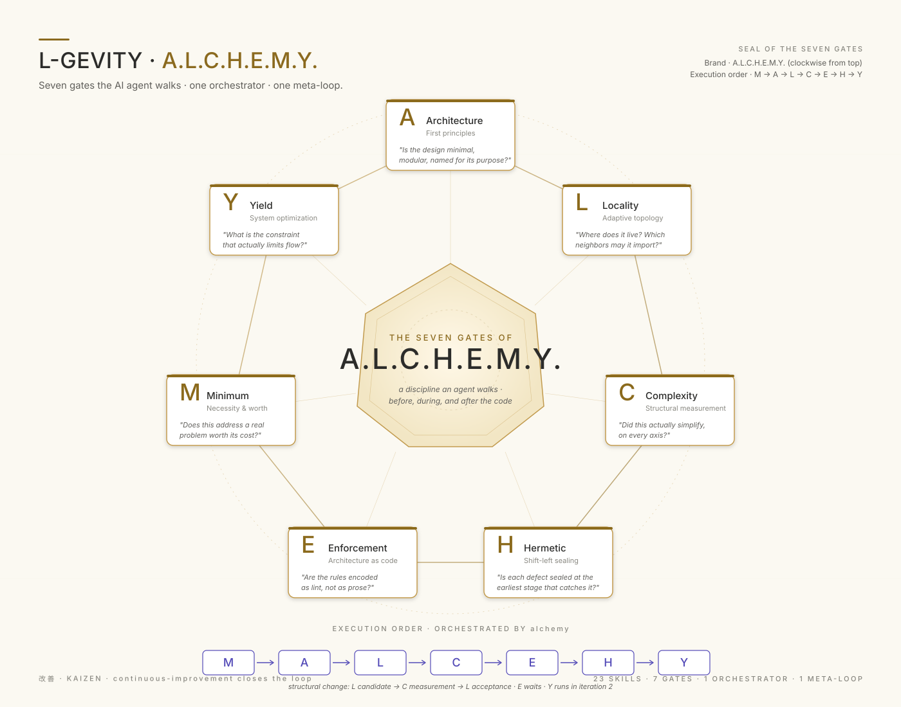
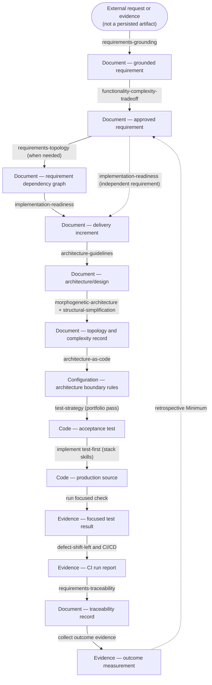
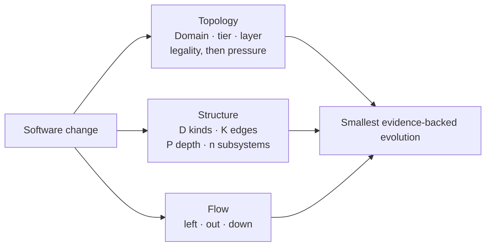
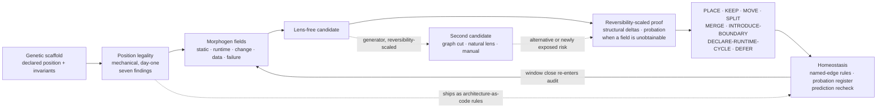

### THE AI ARCHITECT By [Patrick Savalle](https://github.com/patricksavalle)

## Need advice or a review of any part of your DevOps project?

# 'DO SOME ALCHEMY'

    Open-source, platform-agnostic, drop-in for any project and any compatible
    agent that you activate with /alchemy (Claude) or $alchemy (Codex).

    Or just 'do some alchemy' in any context

    The Alchemy router selects the right skill at the right intensity, automatically.
    Super-efficient, no context bloating.
    
Most agent skills teach an AI *how* to do specific tasks — write tests,
scaffold boilerplate, format code. L-GEVITY skills do something different.
They teach an agent how to *think* about software at a structural level:
the voice that asks whether a feature earns its complexity, whether a
pipeline is truly idempotent, whether a structure can be simpler before
it's optimized.

Alchemy is the backbone for structural and architectural quality: is this
worth building, is it well-designed, is it in the right place, is it as
simple as it can be, are the rules enforced as code, are defects caught
early, is the flow optimized. It is, in effect, the architect companion —
not a security, accessibility, UX, API, or release reviewer. Those reviews
live in their own companion skills, triggered independently alongside it.


## 1. Start here

### Install

Prompt your coding agent:

> Install [l-gevity/l-gevity-skills](https://github.com/l-gevity/l-gevity-skills) into this project.

The agent can inspect the repository, choose its installer, and verify the
result. Use the same prompt later to update.

### Use

Start with natural language:

```text
do some alchemy on this refactor
```

Or direct the router:

```text
/alchemy this auth refactor       # Claude Code
$alchemy this auth refactor       # Codex
/alchemy M should we build this?  # one focused gate
/alchemy audit this PR            # expanded analysis
/alchemy ?                        # help
```

Alchemy runs a lightweight preflight, skips routine work, and loads only the
skills the task needs.

Every decision leads with four short plain-language blocks, what I found, why
it matters, do this first, and what I did not check, and then the full record.
The blocks name the record's verdict once, so its vocabulary is picked up on
the way.

Every other skill is invoked the same way, by name.

---

## 2. Where can this skill set help?

Use L-GEVITY when a coding agent needs to decide not only how to implement a
change, but whether it should exist, where it belongs, and what evidence proves
it works.

| I need help with… | Skills |
|---|---|
| Routing a design, refactor, or architecture audit through the smallest useful process | [`alchemy`](./.agents/skills/alchemy/SKILL.md) |
| Turning requests, evidence, obligations, or existing behavior into grounded requirements | [`requirements-grounding`](./.agents/skills/requirements-grounding/SKILL.md) |
| Structuring requirements, resolving dependencies and conflicts, and finding a coherent delivery increment | [`requirements-topology`](./.agents/skills/requirements-topology/SKILL.md), [`implementation-readiness`](./.agents/skills/implementation-readiness/SKILL.md) |
| Deciding whether proposed or existing functionality is worth its complexity | [`functionality-complexity-tradeoff`](./.agents/skills/functionality-complexity-tradeoff/SKILL.md) |
| Designing subsystems and services, placing responsibilities, and untangling dependency topology | [`architecture-guidelines`](./.agents/skills/architecture-guidelines/SKILL.md), [`morphogenetic-architecture`](./.agents/skills/morphogenetic-architecture/SKILL.md) |
| Measuring whether a refactor or restructuring actually simplifies the system | [`structural-simplification`](./.agents/skills/structural-simplification/SKILL.md) |
| Encoding and enforcing architectural boundaries in JavaScript, TypeScript, or Python | [`architecture-as-code`](./.agents/skills/architecture-as-code/SKILL.md), [`architecture-as-code-javascript`](./.agents/skills/architecture-as-code-javascript/SKILL.md), [`architecture-as-code-python`](./.agents/skills/architecture-as-code-python/SKILL.md) |
| Changing a database schema, event or message payload, API body, or file format without breaking the code versions that coexist during rollout and rollback | [`evolutionary-database-design`](./.agents/skills/evolutionary-database-design/SKILL.md) |
| Designing a risk-driven test strategy and moving defect detection to the earliest capable stage | [`test-strategy`](./.agents/skills/test-strategy/SKILL.md), [`defect-shift-left`](./.agents/skills/defect-shift-left/SKILL.md) |
| Designing or auditing reliable build, release, and deployment pipelines | [`ci-cd-reliability-architecture`](./.agents/skills/ci-cd-reliability-architecture/SKILL.md) |
| Linking requirements to implementation, executed verification, operations, and outcome evidence | [`requirements-traceability`](./.agents/skills/requirements-traceability/SKILL.md) |
| Moving recurring toil out of human memory and replacing bespoke code with reusable capabilities | [`push-out`](./.agents/skills/push-out/SKILL.md), [`bring-down`](./.agents/skills/bring-down/SKILL.md) |
| Deciding which artifact owns a fact, decision, or document, and sweeping a tree for the documents no longer worth keeping | [`zero-copy-requirements`](./.agents/skills/zero-copy-requirements/SKILL.md) |
| Deciding what to do about a dependency already in the tree when an advisory, drift, abandonment, or an end-of-life date names it | [`dependency-lifecycle`](./.agents/skills/dependency-lifecycle/SKILL.md) |
| Designing what a change must emit to be detectable in production, and pruning the alerts and telemetry that no longer earn their keep | [`observability-design`](./.agents/skills/observability-design/SKILL.md) |
| Finding bottlenecks, waste, and flow improvements across the software value stream | [`system-optimization`](./.agents/skills/system-optimization/SKILL.md) |
| Improving the skill library itself when recurring agent mistakes expose a systemic gap | [`continuous-improvement`](./.agents/skills/continuous-improvement/SKILL.md) |

---

## 3. Visual model



### A.L.C.H.E.M.Y. pipeline

You don't need to know the ALCHEMY internals, and you don't have to use every stage or step, but here they are.

This is truly more an architectural brain than just a skill set. 

The adaptive preflight keeps the execution cheap, automatically. A focused request runs one gate;
adaptive work runs the smallest ordered subset; only explicit full language
walks the complete route.



### Three quality spaces

Alchemy evaluates a change from three complementary directions instead of
collapsing every dimension into one score.



### Four change primitives

Every stage describes change with the same four words. A **subsystem** is a
part produced by decomposition — where change lands. An **aspect** is a
property that holds across a declared set of subsystems, with one obligation
and one mechanism — which dimension is touched. An **increment** is the bounded
unit of change admitted to implementation — what changes. An **iteration** is
one cycle that admits an increment, realizes it, and measures the resulting
baseline; the next iteration on the same subject starts from that measured
baseline. `alchemy` defines them; each skill's local term specializes exactly
one.

### Living topology

Functionally, "living" means the architecture is a standing hypothesis, not
a diagram drawn once and trusted forever. Placement is cheap and mechanical,
so it runs on every change; restructuring is expensive and evidence-gated,
so it runs only when something is actually challenged. Every accepted
restructuring ships with a predicted effect and a recheck date, so drift
between the declared architecture and the running system surfaces as a
defect instead of accumulating silently — the topology stays continuously
accountable to the code, rather than describing what the code used to be.

Every subsystem declares three coordinates: **domain**, **abstraction tier**,
and **layer** (say UI, service, data). Those coordinates alone are enough to
rule on whether a proposed dependency between two subsystems is legal — the
same way a linter blocks an illegal import without running the program.
Tier and layer have a direction (a UI subsystem may depend on a service, not
the reverse); domain is just a label, with no ranking between domains. Seven
illegal dependency shapes are caught this way, mechanically — no runtime
data, no history, and no need for the rest of the repo to exist yet, so it
works on day one of a greenfield project. The verdict ships as a permanent
`architecture-as-code` rule that keeps enforcing that one dependency
afterward.

Changing the existing structure — merging or splitting subsystems — is
different: it isn't decided by rule, it needs evidence that the current
shape is actually causing problems (coupling, duplicated change, failure
propagation). A competing design has to beat the current one on measured
deltas, and the required proof scales with how hard the change is to undo —
renaming a subsystem needs less justification than collapsing two services.
If every measurement checks out except one that genuinely can't be taken yet,
and the change is cheap to reverse, it can proceed **on probation**: a
recorded expiry, a task to add the missing measurement, and a rollback path.
A later measurement that contradicts the decision overrides the probation
regardless. Every accepted restructuring also records what result it
expects, checked again once that window closes.



---

## 4. Reference

### The gates

The mnemonic is **A.L.C.H.E.M.Y.**; the execution order is
**M → A → L → C → E → H → Y** so value is tested before design is enforced or
optimized.

| Gate | Question |
|---|---|
| **M — Minimum** | Is the functionality worth its complexity? |
| **A — Architecture** | Is the design minimal, modular, and purposeful? |
| **L — Locality** | Is each subsystem in the right boundary? |
| **C — Complexity** | Does the change measurably simplify the system? |
| **E — Enforcement** | Can architectural rules be encoded as checks? |
| **H — Hermetic** | Is each defect caught at the earliest capable stage? |
| **Y — Yield** | What constraint actually limits flow? |

The DevOps improvement moves complement the gates:

| Command | Move |
|---|---|
| `/alchemy left` | Detect defects earlier. |
| `/alchemy out` | Move recurring toil into durable systems. |
| `/alchemy down` | Replace bespoke code with reusable capability. |

<details>
<summary><strong>How routing works</strong></summary>

The [`alchemy`](./.agents/skills/alchemy/SKILL.md) skill classifies work before
loading deeper instructions:

- `SKIP` — routine local work needs no structural analysis.
- `DIRECT` — one question maps to one skill.
- `ADAPTIVE` — non-trivial work gets the smallest ordered route.
- `FULL` — an explicit full audit traverses the complete pipeline.

Its compact result reports the dispatch, route, companions, verdict, reason,
and next action. Focused commands remain focused; use `full`, `all`, or `audit`
when you want a broader trail.

```text
Dispatch:   SKIP | DIRECT | ADAPTIVE | FULL
Core route: None | selected gates
Companions: None | task-matched skills
Verdict:    Proceed | Redesign | Drop | Defer
Next:       one concrete action
```

See [the pipeline design](./ALCHEMY-PIPELINE-DESIGN.md) for routing rules,
requirements qualification, gate handshakes, and acceptance criteria.

Locality starts with a **Rapid placement/static-edge scan** whose first check
is position legality — mechanical, needing no observed field. It escalates
**Rapid → Full** for **restructure · non-static evidence · broad scope · ambiguity**.
Rapid can return `PLACE`, `KEEP`, `DECLARE-RUNTIME-CYCLE`, or `DEFER`; Full can
also return `MOVE`, `SPLIT`, `MERGE`, or `INTRODUCE-BOUNDARY`.

Topology changes use one bounded **L candidate → C measurement → L acceptance**
handshake. L re-enters once; **Gate E cannot run before** that acceptance.
When the only missing proof is a field that cannot be measured yet, a High- or
Medium-reversibility restructuring may be accepted **on probation** — expiry,
instrumentation task, and reversal path recorded, with the recheck placed at
Gate H.

</details>

<details>
<summary><strong>What is included</strong></summary>

The library contains 23 composable skills. Each has an operational `SKILL.md`
and a primer: a standalone concept explainer that teaches the underlying
engineering idea to developers, independent of the skill machinery.

| Skill | Primer |
|---|---|
| [`alchemy`](./.claude/skills/alchemy/SKILL.md) | [Read](./.documentation/READ-alchemy.md) |
| [`functionality-complexity-tradeoff`](./.claude/skills/functionality-complexity-tradeoff/SKILL.md) | [Read](./.documentation/READ-functionality-complexity-tradeoff.md) |
| [`architecture-guidelines`](./.claude/skills/architecture-guidelines/SKILL.md) | [Read](./.documentation/READ-architecture-guidelines.md) |
| [`morphogenetic-architecture`](./.claude/skills/morphogenetic-architecture/SKILL.md) | [Read](./.documentation/READ-morphogenetic-architecture.md) |
| [`structural-simplification`](./.claude/skills/structural-simplification/SKILL.md) | [Read](./.documentation/READ-structural-simplification.md) |
| [`architecture-as-code`](./.claude/skills/architecture-as-code/SKILL.md) | [Read](./.documentation/READ-architecture-as-code.md) |
| [`architecture-as-code-javascript`](./.claude/skills/architecture-as-code-javascript/SKILL.md) | [Read](./.documentation/READ-architecture-as-code-javascript.md) |
| [`architecture-as-code-python`](./.claude/skills/architecture-as-code-python/SKILL.md) | [Read](./.documentation/READ-architecture-as-code-python.md) |
| [`defect-shift-left`](./.claude/skills/defect-shift-left/SKILL.md) | [Read](./.documentation/READ-defect-shift-left.md) |
| [`ci-cd-reliability-architecture`](./.claude/skills/ci-cd-reliability-architecture/SKILL.md) | [Read](./.documentation/READ-ci-cd-reliability-architecture.md) |
| [`system-optimization`](./.claude/skills/system-optimization/SKILL.md) | [Read](./.documentation/READ-system-optimization.md) |
| [`push-out`](./.claude/skills/push-out/SKILL.md) | [Read](./.documentation/READ-push-out.md) |
| [`bring-down`](./.claude/skills/bring-down/SKILL.md) | [Read](./.documentation/READ-bring-down.md) |
| [`requirements-grounding`](./.claude/skills/requirements-grounding/SKILL.md) | [Read](./.documentation/READ-requirements-grounding.md) |
| [`requirements-topology`](./.claude/skills/requirements-topology/SKILL.md) | [Read](./.documentation/READ-requirements-topology.md) |
| [`implementation-readiness`](./.claude/skills/implementation-readiness/SKILL.md) | [Read](./.documentation/READ-implementation-readiness.md) |
| [`requirements-traceability`](./.claude/skills/requirements-traceability/SKILL.md) | [Read](./.documentation/READ-requirements-traceability.md) |
| [`test-strategy`](./.claude/skills/test-strategy/SKILL.md) | [Read](./.documentation/READ-test-strategy.md) |
| [`evolutionary-database-design`](./.claude/skills/evolutionary-database-design/SKILL.md) | [Read](./.documentation/READ-evolutionary-database-design.md) |
| [`continuous-improvement`](./.claude/skills/continuous-improvement/SKILL.md) | [Read](./.documentation/READ-continuous-improvement.md) |
| [`zero-copy-requirements`](./.claude/skills/zero-copy-requirements/SKILL.md) | [Read](./.documentation/READ-zero-copy-requirements.md) |
| [`dependency-lifecycle`](./.claude/skills/dependency-lifecycle/SKILL.md) | [Read](./.documentation/READ-dependency-lifecycle.md) |
| [`observability-design`](./.claude/skills/observability-design/SKILL.md) | [Read](./.documentation/READ-observability-design.md) |

Grounding keeps **decision-relevant outcome hypotheses** separate from
acceptance criteria, avoiding **confusing impact with completion**. Traceability
maintains **versioned outcome measurements and freshness**. **Revisiting value after release**
routes current evidence back to the Minimum gate for a bounded worth decision.

</details>

<details>
<summary><strong>Installation details</strong></summary>

Installers are provided for Claude Code, Codex, Gemini CLI, and Grok CLI on
Windows, Linux, and macOS. Each installs the shared skills into its agent's
skills tree, adds the agent's root instruction file, and records provenance in
`l-gevity-skills.lock.json`. When the project already keeps the other skills
tree, that tree is updated as well.

| Agent | Skills tree | Root instruction file |
|---|---|---|
| Claude Code | `.claude/skills/` | `CLAUDE.md` |
| Codex | `.agents/skills/` | `AGENTS.md` |
| Gemini CLI | `.agents/skills/` | `GEMINI.md` |
| Grok CLI | `.agents/skills/` | `GROK.md` |

An existing root instruction file is preserved; the L-GEVITY version is written
beside it with a `.l-gevity` suffix for manual merging. Locally added skills are
not removed during updates. Set `L_GEVITY_SKILLS_REF` to pin a branch, tag, or
commit.

[Inspect the installer scripts](./.install/).

</details>

<details>
<summary><strong>Scope</strong></summary>

These skills cover structural reasoning: requirements, architecture,
verification strategy, delivery reliability, and improvement. They do not
replace project-specific domain knowledge, coding conventions, security rules,
framework recipes, or release policy. Layer those on with your own skills and
instructions.

</details>

## Contributing

See [CONTRIBUTING.md](./CONTRIBUTING.md) for the genericity and promotion
contract. Licensed under [MIT](./LICENSE).
